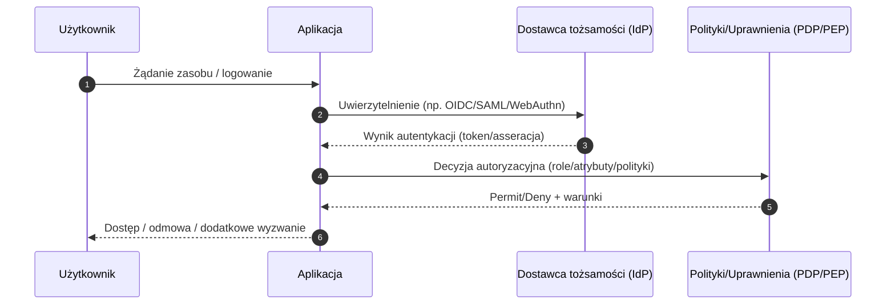
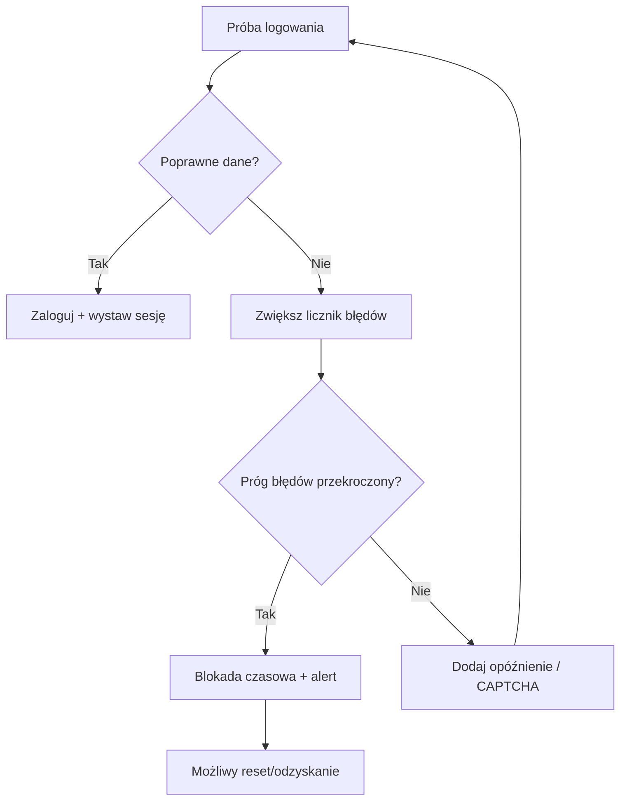
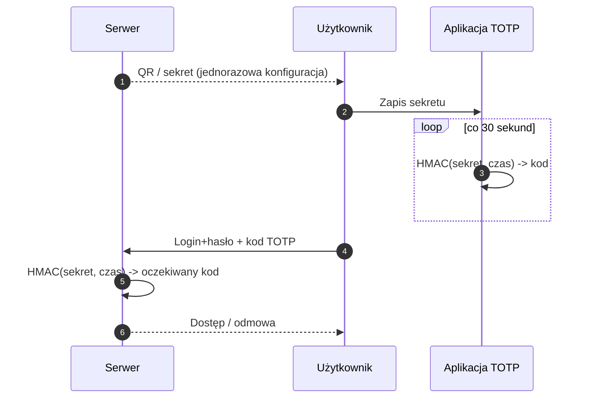
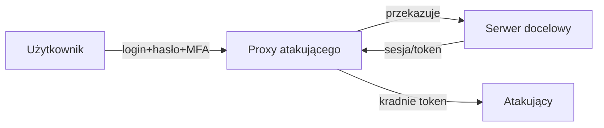
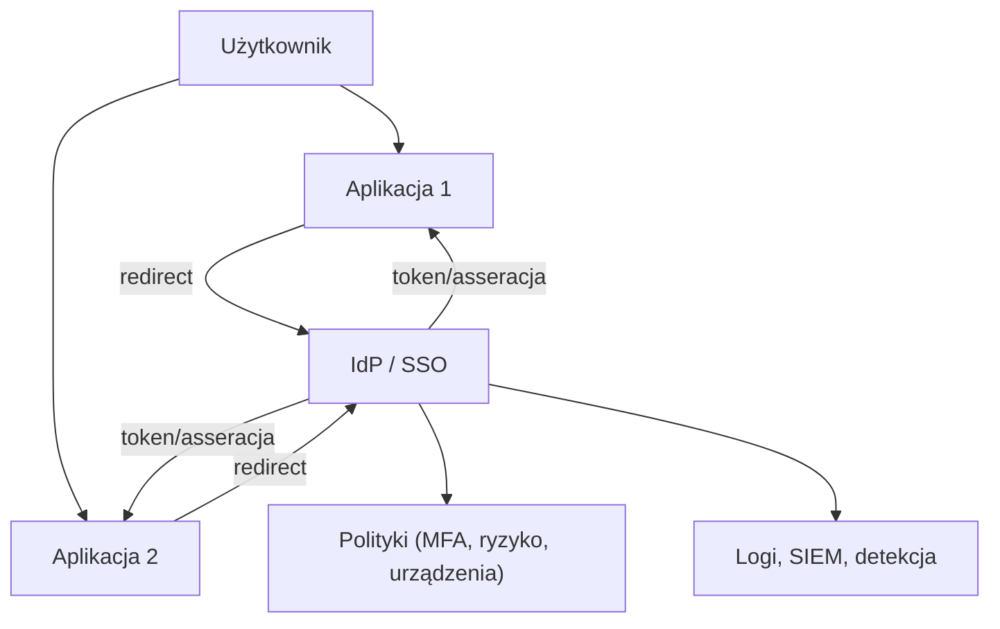
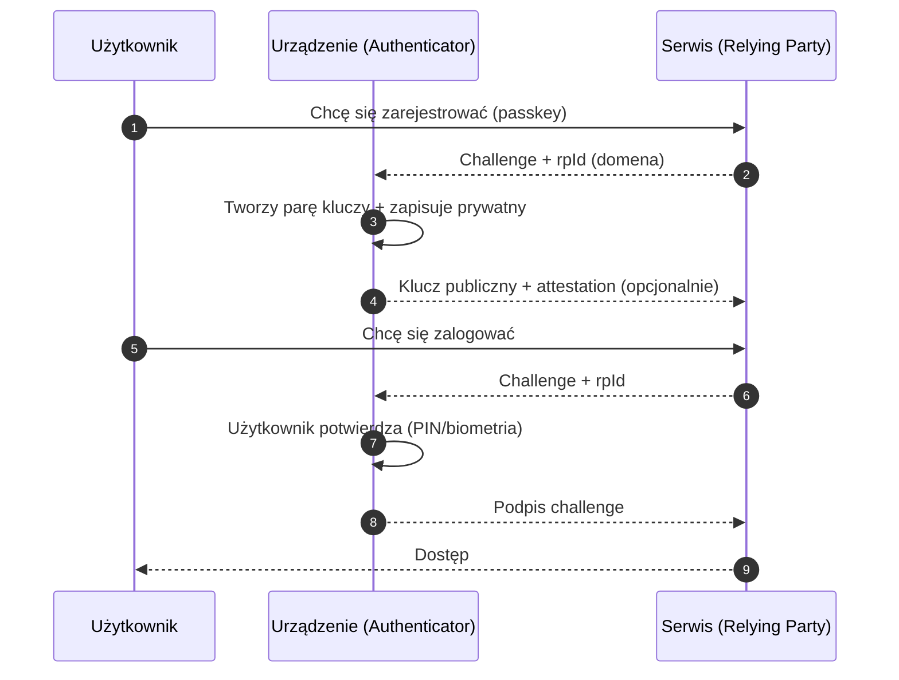
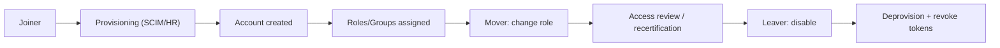
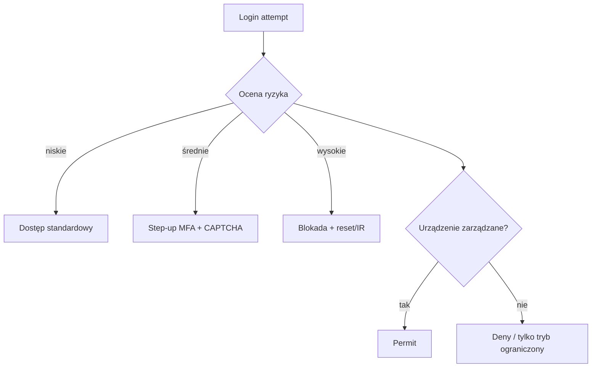

> Ten wpis otwiera cykl **10 artykułów** poświęconych cyberbezpieczeństwu. Zaczynamy od elementu, bez którego nie ma „bezpiecznego systemu”: **konta użytkownika** i mechanizmy, które decydują o tym, *kto* ma dostęp, *do czego*, *kiedy* i *w jaki sposób*.

## Dlaczego konta są osią ataku (i obrony)

W praktyce większość incydentów bezpieczeństwa da się sprowadzić do jednego zdania: **atakujący uzyskał tożsamość (albo jej fragment) i wykorzystał ją, by działać jak uprawniony użytkownik**. Czasem dzieje się to brutalnie (wyciek haseł, brute-force), czasem subtelnie (phishing, przejęcie sesji, token replay), a czasem „procesowo” (złe nadawanie uprawnień, brak revokacji dostępu po odejściu pracownika, nieszczelny onboarding/offboarding).

Konta są punktem styku trzech światów:

1. **Człowiek** (użytkownik, administrator, usługodawca, atakujący),
2. **Aplikacja** (frontend i backend, API, usługi, mikroserwisy),
3. **Infrastruktura** (IdP, katalog, systemy logów, endpointy, MDM, sieć).

Jeżeli tożsamość jest słaba, cały stos jest kruchy. Jeżeli tożsamość jest dobrze zarządzana, zyskujesz dwa filary odporności: *(a)* możliwość ograniczania skutków błędu człowieka, *(b)* możliwość szybkiego wykrycia i odcięcia nadużyć.

## Trzy filary bezpieczeństwa kont: uwierzytelnienie, autentykacja, autoryzacja

W potocznym języku te pojęcia mieszają się. W praktyce projektowej warto je odróżniać, bo odpowiadają różnym etapom łańcucha kontroli dostępu:

- **Uwierzytelnienie (identification + authentication)**: proces potwierdzania, że użytkownik jest tym, za kogo się podaje. W prostym przypadku oznacza „login + hasło”, w nowoczesnym: „klucz kryptograficzny + urządzenie + czynnik lokalny (biometria/PIN)”.
- **Autentykacja (validity of credentials)**: sprawdzenie, czy przedstawione dane uwierzytelniające są prawdziwe (np. czy hash hasła się zgadza, czy podpis kryptograficzny jest poprawny, czy token jest ważny).
- **Autoryzacja (authorization)**: nadawanie i egzekwowanie uprawnień, czyli odpowiedź na pytanie „co ten użytkownik może zrobić po zalogowaniu”.

Pomyłki na tych etapach kosztują: możesz mieć idealnie bezpieczne hasła, a i tak wpuścić użytkownika do zasobu, do którego nie powinien mieć dostępu.

Poniższy diagram pokazuje typowy przepływ:



W cyklu wpisów będziemy do tego wracać, bo tożsamość to nie tylko „ekran logowania”, ale cały system decyzyjny.

## Podstawowe dane logowania: nazwa użytkownika i hasło (i dlaczego to wciąż problem)

Najczęstsza para to:

- **Nazwa użytkownika** – identyfikator konta (login, e-mail, numer pracownika).
- **Hasło** – sekret, który *ma znać tylko użytkownik*.

W teorii prosto. W praktyce hasła mają trzy fundamentalne wady:

1. Są łatwe do ponownego użycia (re-use) między serwisami,
2. Są trudne do zapamiętania, jeśli mają być długie i unikalne,
3. Są podatne na przechwycenie (phishing, keylogger, MITM, wycieki baz).

Dlatego współczesne bezpieczeństwo kont opiera się na *minimalizacji roli hasła* (przez MFA i passkeys) oraz na *ograniczaniu skutków kompromitacji hasła* (rate limiting, blokady, monitorowanie logowań, wykrywanie anomalii).

## Jak atakują hasła: słownik i brute-force

Zanim zaczniesz „wzmacniać” hasła, zrozum, jak działają ataki:

### 1) Atak słownikowy (dictionary attack)

Atakujący próbuje logować się zestawem popularnych haseł: `password123`, `qwerty`, `admin`, `123456`, imiona, daty, nazwa firmy, nazwa serwisu. To działa, bo ludzie tworzą hasła przewidywalne, a wycieki haseł są masowe i powtarzalne.

### 2) Atak brute-force

Systematyczne testowanie kombinacji znaków. W środowisku online ogranicza go zwykle **limit prób**, ale w środowisku offline (po wycieku hashy) ogranicza go głównie koszt obliczeń.

Kluczowy wniosek jest prosty: **długość hasła bije „wymyślność”**. 12–15 znaków (albo więcej) daje skokowy wzrost przestrzeni poszukiwań, a długi passphrase (np. 4–5 losowych słów) jest często wygodniejszy niż „Tr0udn3H@sło!”.

## Standardy NIST: co naprawdę ma sens w politykach haseł

Wiele organizacji wciąż tkwi w starych wzorcach: wymuszanie częstych zmian, skomplikowane reguły (wielkie litery, cyfry, znaki specjalne), pytania pomocnicze, „podpowiedzi do hasła”. Nowoczesne podejście (promowane m.in. przez NIST) przesuwa akcent na:

- **minimalną długość** (co najmniej 8, praktycznie więcej w kontach krytycznych),
- **wysoki limit maksymalny** (do 64 znaków lub więcej),
- **akceptację szerokiego zestawu znaków** (ASCII + Unicode),
- **blokowanie haseł znanych ze wycieków** (kompromitowanych),
- **rezygnację z podpowiedzi i pytań „sekretów”**.

Z punktu widzenia projektanta systemu najważniejsze są dwie rzeczy: *kontroluj jakość hasła bez irytowania użytkownika* oraz *nie twórz polityk, które prowadzą do obchodzenia zabezpieczeń*.

### Blokowanie haseł skompromitowanych (must-have)

Jeżeli system pozwala ustawić hasło `Password1!`, to ktoś je ustawi. Jeżeli system nie sprawdza, czy hasło było w wyciekach, to wcześniej czy później atakujący wejdzie przez „credential stuffing” (wykorzystanie par login-hasło z innych wycieków).

Praktyczna rekomendacja: stosuj listy haseł skompromitowanych (np. HIBP lub lokalnie utrzymywane listy) i **odrzucaj** hasła słabe, słownikowe, kontekstowe.

> Uwaga dla architektów: takie sprawdzanie powinno być zrobione tak, aby nie wyciekały hasła do zewnętrznych usług (np. przez k-anonimowość lub lokalne bazy).

## „Koniec z wymuszaniem zmian” — czyli jak nie produkować słabych haseł

Wymuszanie rotacji haseł co 30/60/90 dni to klasyczny przykład zabezpieczenia, które w praktyce obniża bezpieczeństwo:

- użytkownicy tworzą sekwencje (`Haslo01`, `Haslo02`, ...),
- zapisują hasła w notatkach,
- używają prostych schematów modyfikacji,
- ignorują alerty, bo „znowu trzeba zmieniać”.

Lepsza praktyka: **zmieniaj hasło wtedy, gdy jest ku temu powód**:
- podejrzenie kompromitacji,
- wykrycie logowania z nietypowej lokalizacji,
- incydent w organizacji,
- reset konta po przejęciu.

To podejście łączy się z monitorowaniem i wymuszeniem MFA.

## Ograniczanie prób logowania: rate limiting, opóźnienia i blokady

Jeżeli pozwalasz na nieograniczoną liczbę prób logowania, prosisz się o brute-force i credential stuffing.

W praktyce masz trzy warstwy ochrony:

1. **Rate limiting** (ograniczenie szybkości prób) – np. 5 prób/minutę na konto/IP/urządzenie,
2. **Backoff** – rosnące opóźnienia (1s, 2s, 4s, 8s…),
3. **Tymczasowa blokada** – np. 15 minut po 10 nieudanych próbach.

Dobre systemy robią to adaptacyjnie: jeśli widać atak rozproszony (botnet), reagują inną logiką niż przy „pomyłkach użytkownika”.

Przykład schematu decyzyjnego:



### Ważny detal UX: komunikaty błędów

Błędy typu „niepoprawny login lub hasło” są bezpieczne (nie ujawniają, czy konto istnieje), ale bywają frustrujące. Z kolei komunikat „hasło za krótkie, min. 12 znaków” jest cenny przy rejestracji/zmianie hasła.

Zasada kompromisu:
- **przy logowaniu**: nie ujawniaj, czy konto istnieje,
- **przy ustawianiu hasła**: dawaj precyzyjne wskazówki jakości.

## Przechowywanie haseł: czego absolutnie nie robić

Najgorszy grzech: **hasła w jawnym tekście**. Drugi grzech: „hash” hasła bez soli. Trzeci: szybkie funkcje hashujące (np. SHA-256) bez mechanizmu spowalniającego.

Nowoczesne przechowywanie haseł oznacza:

- **hashowanie** (jednokierunkowe),
- **solenie** (unikalna sól per hasło),
- **opcjonalnie pieprzenie** (sekretny „pepper” trzymany poza bazą danych),
- **funkcje odporne na ataki offline** (Argon2id / scrypt / bcrypt z odpowiednimi parametrami).

### Dlaczego to jest takie ważne?

Bo wyciek bazy haseł *zdarzy się* — prędzej czy później. Twoim celem jest sprawić, aby:
- łamanie offline było **kosztowne**,
- atakujący miał **mało sensownej wartości** z samych hashy,
- czas potrzebny na złamanie był większy niż „okno użyteczności” hasła.

### Przykład (Python): Argon2id

Poniższy kod ilustruje użycie Argon2id do hashowania hasła. Parametry dobiera się do możliwości serwera (RAM/CPU) i wymaganego poziomu bezpieczeństwa.

```python
from argon2 import PasswordHasher
from argon2.exceptions import VerifyMismatchError

ph = PasswordHasher(
    time_cost=3,        # liczba iteracji
    memory_cost=65536,  # KB, czyli ~64 MB
    parallelism=2,
    hash_len=32,
    salt_len=16,
)

hash_ = ph.hash("dlugie-losowe-haslo-albo-passphrase")

try:
    ph.verify(hash_, "dlugie-losowe-haslo-albo-passphrase")
    print("OK")
except VerifyMismatchError:
    print("BŁĄD")
```

> To przykład dydaktyczny: w produkcji dochodzi obsługa migracji parametrów, polityk i mechanizmów rate limiting.

## MFA/2FA: warstwa, która realnie zmienia grę

Jeżeli hasła są kruche, to **MFA** jest tańszą i skuteczniejszą odpowiedzią niż „jeszcze bardziej złożone hasło”.

### 2FA vs MFA

- **2FA**: dokładnie dwa czynniki,
- **MFA**: dwa lub więcej, zwykle w praktyce „co najmniej dwa”.

### Trzy klasyczne czynniki

1. **Wiedza** – coś, co znasz (hasło, PIN),
2. **Posiadanie** – coś, co masz (telefon, token, klucz sprzętowy),
3. **Cecha/obecność** – coś, czym jesteś (biometria) lub „dowód obecności” na urządzeniu.

Właściwie wdrożone MFA:
- minimalizuje ryzyko przejęcia konta po wycieku hasła,
- ogranicza skuteczność phishingu (choć nie eliminuje go całkowicie),
- pozwala lepiej kontrolować ryzyko (np. step-up authentication).

### Kody SMS: dlaczego „działają” i dlaczego są ryzykowne

SMS jako drugi czynnik jest popularny, bo jest prosty. Jest też ryzykowny, bo:
- można przejąć numer (SIM swapping),
- SMS bywa podatny na przechwycenie na poziomie operatora,
- użytkownicy przenoszą numery, tracą urządzenia, zmieniają SIM.

Jeśli musisz używać SMS (np. w migracji), traktuj to jako etap przejściowy. Preferuj aplikacje TOTP lub klucze sprzętowe.

## OTP i TOTP: jak działają kody jednorazowe

**OTP** (One-Time Password) to hasło ważne tylko raz albo przez krótki czas. Najczęściej spotkasz **TOTP** (Time-based OTP): kod zmienia się co 30 sekund.

Mechanizm jest elegancki: serwer i aplikacja mają wspólny sekret i niezależnie wyliczają kod na podstawie czasu.



**Ważne**: sekret TOTP trzeba chronić jak hasło. Jeśli ktoś go przejmie, ma „drugi czynnik”.

## Tokeny sprzętowe: dlaczego są tak mocne

Tokeny sprzętowe (np. klucze typu YubiKey) mają dwie wielkie zalety:

1. **Trudniej je przejąć zdalnie** – atakujący musi mieć fizyczny dostęp,
2. W trybach U2F/FIDO2 są **odporne na phishing** (wiążą uwierzytelnienie z domeną).

To powód, dla którego w środowiskach podwyższonego ryzyka (admini, DevOps, konta uprzywilejowane) token sprzętowy jest standardem.

## Najczęstsze zagrożenia: phishing, keylogging, MITM, SIM swapping

### Keylogging: kradzież danych „u źródła”

Keylogger (software lub hardware) przechwytuje naciśnięcia klawiszy. Hasło może być idealne, ale jeśli zostało wpisane na zainfekowanej stacji, atakujący je zna. Obrona to głównie:
- higiena endpointów (EDR/AV, aktualizacje),
- separacja kont (brak logowania kontem admina na stacjach biurowych),
- MFA i passkeys (ograniczają wartość hasła).

### Phishing: najtańsza i najskuteczniejsza socjotechnika

Phishing jest skuteczny, bo:
- działa na emocje (pośpiech, strach, autorytet),
- wykorzystuje podobieństwo domen (typosquatting),
- potrafi przechwycić nie tylko hasło, ale i kody MFA (phishing proxy / real-time).

W praktyce phishing dzieli się na:
- masowy (kampanie),
- ukierunkowany (spear phishing),
- bardzo ukierunkowany (whaling — na osoby decyzyjne).

Najlepsza obrona to kombinacja:
- świadomość użytkowników,
- filtrowanie i ochrony poczty,
- MFA odporne na phishing (FIDO2/passkeys),
- wykrywanie anomalii logowania.

### MITM (Machine-in-the-Middle): atak w czasie rzeczywistym

W MITM atakujący wchodzi „pomiędzy” użytkownika a serwer, przechwytując lub modyfikując ruch. W praktyce często jest to połączenie phishingu z proxy (atakujący udaje stronę, ale po cichu loguje do prawdziwej usługi).



To kluczowy powód, dla którego **„MFA oparte o kody” nie jest panaceum**. U2F/FIDO2 i passkeys, które wiążą uwierzytelnienie z domeną, redukują ryzyko takiego proxy.

### SIM swapping: przejęcie numeru = przejęcie SMS-ów

SIM swapping to atak na procesy operatora i człowieka: przestępca przekonuje operatora, że jest Tobą i prosi o duplikat SIM. Skutek: SMS-y i połączenia trafiają do atakującego, a on przejmuje konta, które używają SMS jako 2FA.

Obrona:
- unikaj SMS jako docelowego 2FA,
- ustaw PIN/hasło u operatora,
- monitoruj „dziwne” zdarzenia (brak zasięgu, nagłe wylogowania).

## Menedżery haseł: „must-have” w świecie wielu kont

W realnym życiu każdy ma dziesiątki (albo setki) kont. Jeśli chcesz, żeby hasła były:
- długie,
- losowe,
- unikalne,

to **nie ma drogi bez menedżera haseł** (wbudowanego lub zewnętrznego). Menedżer rozwiązuje dwa problemy naraz:
- generowanie haseł,
- bezpieczne przechowywanie i autofill.

### Najważniejsze praktyki z menedżerami

- Chroń **hasło główne** (master password) jak klucz do domu.
- Włącz **MFA** do menedżera.
- Używaj **audytu haseł** (wykrywanie powtórzeń i słabych haseł).
- Rozważ model organizacyjny (dla firm): współdzielenie sekretów w zespołach, rotacja, audyt dostępu.

## SSO: wygoda i ryzyko „jednego punktu upadku”

**Single Sign-On** pozwala logować się do wielu usług jednym kontem. Z punktu widzenia organizacji to plus: centralne polityki, MFA, offboarding. Z punktu widzenia ryzyka to również koncentracja: jedno konto może dać dostęp do całej firmy.

Typowy układ z OIDC/SAML:



W środowisku SSO krytyczne stają się:
- bezpieczeństwo kont uprzywilejowanych w IdP,
- warunki dostępu (Conditional Access: urządzenie, geolokalizacja, ryzyko),
- monitoring i reakcja na anomalia.

## Passkeys (klucze dostępu): przyszłość uwierzytelniania

Passkeys to podejście, które eliminuje potrzebę hasła. Użytkownik nie „wpisuje sekretu”. Zamiast tego:
- na urządzeniu powstaje para kluczy (publiczny/prywatny),
- serwer przechowuje publiczny,
- logowanie polega na podpisaniu wyzwania kluczem prywatnym,
- użytkownik potwierdza operację lokalnie (PIN/biometria).

To daje dwie potężne własności:
1. **Odporność na phishing** (klucze są związane z domeną),
2. **Brak sekretu, który da się „przepisać”** (nie ma hasła do wyłudzenia).

### Uproszczony przebieg passkey



Passkeys w praktyce opierają się o **WebAuthn** (standard przeglądarkowy) i FIDO2.

## Technicznie: WebAuthn w 10 minut (dla inżyniera)

Jeżeli jesteś programistą, warto zrozumieć podstawowy model WebAuthn, bo coraz więcej systemów będzie tego wymagać.

### Obiekty i role

- **Relying Party (RP)**: Twoja aplikacja/serwis, który ufa WebAuthn.
- **Authenticator**: urządzenie/komponent generujący klucze (telefon, klucz USB, wbudowany moduł).
- **Client**: przeglądarka, która realizuje API WebAuthn.

### Dwa kluczowe etapy

1. **Registration (create)**: RP wysyła `challenge` + `rpId`, a klient tworzy poświadczenie i odsyła publiczny klucz.
2. **Authentication (get)**: RP wysyła `challenge`, klient podpisuje, RP weryfikuje podpis kluczem publicznym.

### Minimalny szkic (serwer): wyzwanie i weryfikacja

W praktyce nie implementuje się kryptografii „ręcznie”. Używa się bibliotek (np. w Node/Go/Java/Python) obsługujących:
- generowanie wyzwań,
- parsowanie odpowiedzi klienta,
- weryfikację podpisu,
- kontrolę `rpId`, origin, counter, itp.

Pseudokod:

```text
# REGISTER
challenge = random_bytes()
store(challenge, session)
send_to_client({
  rpId, challenge, user, pubKeyCredParams, authenticatorSelection
})

# VERIFY REGISTER RESPONSE
resp = client_response()
assert resp.origin == expected_origin
assert resp.rpIdHash matches rpId
assert resp.challenge == stored_challenge
store_credential(userId, credentialId, publicKey, signCount)

# AUTH
challenge = random_bytes()
store(challenge, session)
send_to_client({ rpId, challenge, allowCredentials })

# VERIFY AUTH RESPONSE
resp = client_response()
cred = load_credential(resp.credentialId)
assert resp.challenge == stored_challenge
verify_signature(cred.publicKey, resp.signedData)
check_and_update_signCount(cred, resp.signCount)
```

> W kolejnych wpisach wrócimy do tematów typu *phishing-resistant MFA*, polityki dostępowe i zarządzanie kontami uprzywilejowanymi — tam WebAuthn pojawi się ponownie.

## Konta uprzywilejowane: „crown jewels” organizacji

W firmach są konta, których kompromitacja jest krytyczna:
- administratorzy systemów,
- konta serwisowe (CI/CD, backup),
- konta do chmury (AWS/GCP/Azure),
- konta do IdP/SSO.

Dla nich standardem powinny być:
- klucze sprzętowe lub passkeys,
- zasada najmniejszych uprawnień,
- separacja środowisk (prod/test),
- MFA z politykami warunkowymi,
- logowanie i audyt (SIEM),
- PAM (Privileged Access Management) w większych organizacjach.

## Praktyczne rekomendacje: dla użytkownika, dla zespołu IT, dla projektanta systemu

### Dla każdego użytkownika (student, pracownik, admin)

1. Używaj **menedżera haseł** i twórz hasła unikalne.
2. Włącz **MFA** wszędzie, gdzie to możliwe (preferuj TOTP/klucz).
3. Dla kont krytycznych (poczta, SSO, bank, Git) używaj **passkeys** lub klucza sprzętowego.
4. Nie klikaj w linki „na autopilocie” — weryfikuj domenę, certyfikat, kontekst.
5. Aktualizuj urządzenia i przeglądarkę — wiele przejęć kont zaczyna się od przejęcia sesji na starym kliencie.

### Dla zespołu IT (IAM / SecOps / Helpdesk)

1. Wprowadź politykę blokowania haseł z wycieków (credential screening).
2. Włącz **rate limiting** i mechanizmy blokad.
3. Standaryzuj MFA (TOTP/FIDO2) i ogranicz SMS.
4. Zaprojektuj procesy: onboarding/offboarding, reset haseł, odzyskiwanie kont.
5. Monitoruj logowania: anomalia, niemożliwe podróże, nowe urządzenia.
6. Zabezpiecz IdP: harden, segmentacja, logging, break-glass accounts.

### Dla projektanta aplikacji (dev, architekt)

1. Nie przechowuj haseł „po swojemu” — używaj sprawdzonych bibliotek, Argon2id, właściwe parametry.
2. Projektuj odporność na phishing: WebAuthn/passkeys, device binding, krótkie sesje.
3. Rozdziel odpowiedzialności: IdP do logowania, PDP/PEP do autoryzacji.
4. Stosuj „secure by default”: MFA jako rekomendacja, a dla ról wrażliwych — jako wymóg.
5. Traktuj logowanie jako **proces**, nie endpoint: telemetry, alerty, detekcja.

## Odzyskiwanie konta: najsłabsze ogniwo, jeśli zrobisz to źle

Nie ma systemu bez scenariusza „zapomniałem hasła” albo „zgubiłem telefon”. Jednocześnie recovery jest ulubionym wektorem ataku, bo często ma słabsze zabezpieczenia niż logowanie.

Dobre praktyki:
- Recovery powinno być **równie silne jak logowanie**.
- Unikaj pytań „sekretów” (imię zwierzaka) — to dane łatwe do OSINT.
- Rozważ **kody zapasowe**, urządzenia zaufane, recovery przez helpdesk z weryfikacją.
- W środowisku firmowym: formalne procedury i logowanie decyzji.

## Krótka checklista audytowa (start)

Poniżej lista kontrolna, którą możesz użyć do przeglądu systemu (aplikacji lub organizacji). Nie jest kompletna, ale świetnie nadaje się jako „pierwszy skan”.

### Polityka haseł
- [ ] Minimalna długość >= 12 dla kont krytycznych
- [ ] Maksymalna długość >= 64
- [ ] Blokowanie haseł skompromitowanych i słownikowych
- [ ] Brak wymuszonej rotacji bez incydentu
- [ ] Brak podpowiedzi do haseł / pytań „sekretów”

### Uwierzytelnianie
- [ ] MFA dostępne dla wszystkich, wymagane dla ról wrażliwych
- [ ] Preferowane TOTP/FIDO2, SMS tylko przejściowo
- [ ] Rate limiting / blokady / backoff
- [ ] Wykrywanie podejrzanych logowań (nowe urządzenie, geolokalizacja)

### Przechowywanie i sesje
- [ ] Argon2id/bcrypt/scrypt z właściwymi parametrami
- [ ] Sól per hasło, opcjonalnie pepper
- [ ] Bezpieczne sesje (HttpOnly, SameSite, rotacja tokenów)
- [ ] Możliwość natychmiastowego unieważnienia sesji (logout everywhere)

### Procesy i organizacja
- [ ] Offboarding (odebranie dostępu) w godzinach, nie tygodniach
- [ ] Konta serwisowe mają rotację sekretów i minimalne uprawnienia
- [ ] Logi z IdP i aplikacji trafiają do centralnego miejsca (SIEM)
- [ ] Procedury recovery i resetu są kontrolowane i audytowalne

## Co dalej w cyklu (zapowiedź 2/10 – 10/10)

W kolejnych wpisach rozwinę wątki, które tu tylko zasygnalizowałem, m.in.:

- **(2/10)** Modele uprawnień i polityki dostępu: RBAC/ABAC/PBAC, najmniejsze uprawnienia, separacja obowiązków  
- **(3/10)** Tożsamość w praktyce: IdP, katalog, SSO, OIDC/SAML, architektury referencyjne  
- **(4/10)** Sesje, tokeny i bezpieczeństwo aplikacji: cookies, JWT, rotacja, CSRF, replay  
- **(5/10)** Konta uprzywilejowane i PAM: JIT/JEA, break-glass, skarbce sekretów  
- **(6/10)** Ataki na uwierzytelnianie: phishing proxy, MFA fatigue, token theft, SIM swapping  
- **(7/10)** Bezpieczeństwo endpointów i tożsamości urządzeń: MDM, posture, EDR, device binding  
- **(8/10)** Monitoring i detekcja nadużyć kont: logi, UEBA, alerting, IR playbooks  
- **(9/10)** Zarządzanie cyklem życia kont: onboarding/offboarding, automatyzacja, compliance  
- **(10/10)** „Zero Trust” w praktyce: tożsamość jako perymetr, segmentacja, ciągła weryfikacja

---

### Podsumowanie

Bezpieczeństwo kont wymaga podejścia warstwowego: **długie i unikalne hasła**, **MFA**, odporność na **phishing**, mechanizmy **rate limiting**, bezpieczne przechowywanie sekretów oraz dobrze zaprojektowane procesy odzyskiwania i odebrania dostępu. Jeśli miałbym wskazać jedną zasadę, to brzmiałaby ona tak:

> **Tożsamość jest nowym perymetrem.** Jeżeli ją wzmocnisz, większość pozostałych warstw zacznie działać lepiej.

Jeśli chcesz, w następnym kroku mogę przygotować też wersję „dla organizacji” jako politykę bezpieczeństwa (IAM policy) oraz krótkie zadania/laby dla studentów do wykorzystania na zajęciach.


## Model zagrożeń dla kont: od czego zacząć, zanim „dokleisz MFA”

W cyberbezpieczeństwie łatwo wpaść w pułapkę „listy dobrych praktyk”. Problem w tym, że bez *modelu zagrożeń* nie wiesz, które praktyki są krytyczne, a które są „nice to have”. Dla kont użytkowników model zagrożeń można zbudować szybko, odpowiadając na cztery pytania:

1. **Jakie zasoby chronisz?** (dane osobowe, kod źródłowy, finanse, dostęp do infrastruktury, tajemnice przedsiębiorstwa)
2. **Kto jest przeciwnikiem?** (skrypt-kiddie, cyberprzestępca, konkurencja, insider, APT)
3. **Jaki jest wektor wejścia?** (hasło, sesja, API token, reset hasła, helpdesk, SSO, urządzenie końcowe)
4. **Jakie są skutki przejęcia?** (kradzież danych, ransomware, sabotaż, wyłudzenia, utrata reputacji)

### „Zwykłe konto” vs konto krytyczne

W praktyce nie każde konto jest tak samo wrażliwe. Prosty podział:

- **Konta codzienne**: dostęp do mniej krytycznych zasobów (np. forum, platforma e-learning).
- **Konta wrażliwe**: dostęp do danych osobowych, poczty, repozytoriów, systemów płatności.
- **Konta uprzywilejowane**: administracja, konfiguracja, zarządzanie uprawnieniami, dostęp do chmury/IdP.

To rozróżnienie jest ważne, bo pozwala wdrożyć politykę „mocniej tam, gdzie ryzyko jest najwyższe”. Przykład:
- użytkownik forum: MFA opcjonalne,
- pracownik: MFA wymagane,
- admin: klucz sprzętowy/passkey + dodatkowe warunki (urządzenie zarządzane, sieć firmowa, JIT).

### STRIDE dla tożsamości (szybka ściąga)

Jeśli znasz STRIDE (Spoofing, Tampering, Repudiation, Information Disclosure, Denial of Service, Elevation of Privilege), to w IAM daje on bardzo praktyczne pytania:

- **Spoofing**: czy ktoś może podszyć się pod użytkownika? (phishing, kradzież hasła, przejęcie sesji)
- **Tampering**: czy ktoś może zmodyfikować dane autoryzacyjne? (tokeny, claimy, role)
- **Repudiation**: czy mamy audyt i dowody działań? (logi, korelacja, niezmienność)
- **Information Disclosure**: czy ujawniamy dane logowania lub metadane kont? (enumeracja kont, błędy)
- **DoS**: czy logowanie można „zabić” prostym atakiem? (brute-force, blokady celujące w użytkowników)
- **EoP**: czy użytkownik może podnieść uprawnienia? (błędy RBAC, złe polityki, brak separacji)

To pomaga ustawić priorytety: zanim zrobisz „ładny ekran hasła”, upewnij się, że nie ma **EoP** i **Spoofing**.


## Credential stuffing i enumeracja kont: dwa niedoceniane problemy

### Credential stuffing: logowanie cudzymi danymi z wycieków

Credential stuffing to sytuacja, w której atakujący bierze pary `login:hasło` z wycieków i automatycznie testuje je w Twoim serwisie. To działa z dwóch powodów: ludzie powtarzają hasła, a atakujący ma ogromne listy i automatyzację.

Obrona wymaga kombinacji:
- rate limiting (per IP, per konto, per fingerprint urządzenia),
- wykrywanie botów (WAF, behavioral signals),
- blokowanie haseł skompromitowanych,
- MFA (najskuteczniejszy „hamulec”),
- wykrywanie anomalii i reagowanie (np. czasowe blokady, alerty).

### Enumeracja kont: „czy ten e-mail istnieje?”

Atakujący uwielbia wiedzieć, czy konto istnieje, bo może dobrać hasło, prowadzić phishing bardziej wiarygodny i wykryć konta uprzywilejowane.

Typowe miejsca enumeracji:
- logowanie („konto nie istnieje” vs „złe hasło”),
- reset hasła („wysłaliśmy link” vs „nie znamy adresu”),
- rejestracja („adres zajęty”),
- API (różne kody błędów).

Zasada: w publicznych interfejsach nie ujawniaj istnienia konta. Przykład poprawnego resetu hasła: *„Jeśli konto istnieje, wyślemy instrukcje na e-mail”*. A wewnętrznie — oczywiście loguj i monitoruj.


## Siła hasła w praktyce: entropia, długość i passphrase

Hasła to temat, w którym „intuicja” często szkodzi. Dwa mity: **„złożoność > długość”** oraz **„znak specjalny czyni hasło bezpiecznym”**. W większości przypadków długość i losowość wygrywają, bo przestrzeń poszukiwań rośnie wykładniczo.

### Passphrase: kompromis bezpieczeństwa i użyteczności

Passphrase (dłuższa fraza) może być łatwiejsza do zapamiętania i trudniejsza do złamania brute-force. Zasada: jeśli passphrase ma być „ludzka”, niech będzie długa (np. 4–5 losowych słów), nieoczywista i niepowiązana z Tobą (brak danych osobowych).

### Dlaczego „wymuszenia złożoności” często nie działają

Reguły typu „musi być wielka litera i znak specjalny” powodują przewidywalne modyfikacje (`Haslo!`, `Haslo1!`), frustrację i zapisywanie haseł. Lepsza reguła to: minimalna długość + sprawdzenie przeciw wyciekom + zachęta do menedżera haseł.


## Sesje i tokeny: gdzie ginie bezpieczeństwo po „udanym logowaniu”

Przejęcie konta nie zawsze oznacza złamanie hasła. Często oznacza **kradzież sesji**. Jeśli atakujący ukradnie cookie sesyjne lub token, może ominąć logowanie.

### Cookies sesyjne (web)

Dobre praktyki:
- `HttpOnly` (JS nie czyta cookie),
- `Secure` (tylko HTTPS),
- `SameSite=Lax/Strict` (redukcja CSRF),
- rotacja identyfikatora sesji po logowaniu i po podniesieniu uprawnień,
- rozsądne TTL (krótkie dla paneli admina).

### JWT i tokeny (API)

JWT bywa wygodny, ale ma typowe pułapki: „wiecznie ważny token”, brak unieważniania, przechowywanie w localStorage (ekspozycja na XSS). Bezpieczniejszy model to krótko żyjący access token + refresh token w cookie HttpOnly + rotacja refresh + możliwość revokacji.

> Wpis 4/10 będzie w całości o sesjach, tokenach i bezpieczeństwie aplikacji — tutaj sygnalizujemy tylko najważniejsze ryzyka.


## MFA fatigue i „push bombing”: gdy MFA bywa atakowane

Gdy organizacja wdraża push-based MFA (powiadomienie „Zatwierdź logowanie”), pojawia się atak **MFA fatigue**: atakujący ma hasło, wysyła dziesiątki żądań MFA, a użytkownik z irytacji „zatwierdza, żeby przestało pikać”.

Obrona:
- limit prób i blokady,
- edukacja: „nigdy nie zatwierdzaj, jeśli nie logujesz się teraz”,
- number matching (użytkownik przepisuje numer),
- preferowanie phishing-resistant MFA (FIDO2).


## Reset hasła i recovery: jak to robić bezpiecznie

Nie ma systemu bez scenariusza „zapomniałem hasła” albo „zgubiłem telefon”. Jednocześnie recovery jest ulubionym wektorem ataku, bo często ma słabsze zabezpieczenia niż logowanie.

### Bezpieczny reset hasła (email-based)

Szkielet:
1. Użytkownik prosi o reset.
2. System generuje **jednorazowy token** o wysokiej entropii.
3. Token jest ważny krótko (np. 15–30 minut) i jednorazowy.
4. Po resecie unieważnij sesje („logout everywhere”) i wymuś ponowne logowanie.

Technicznie token nie powinien być przechowywany w bazie wprost — tak jak hasło, token warto hashować.

### Kody zapasowe (backup codes)

Generujesz zestaw kodów jednorazowych, które użytkownik przechowuje offline. To proste, a w krytycznych kontach bardzo skuteczne.


## Konta serwisowe i sekrety: „niewidzialne konta”, które robią największe szkody

W świecie DevOps wiele „kont” to procesy: tokeny do API, klucze do chmury, sekrety w CI/CD, klucze do backupów. Wyciekają przez repozytoria, logi, konfiguracje IaC, obrazy kontenerów.

Dobre praktyki:
- trzymanie sekretów w sejfie (Vault/KMS/Secrets Manager),
- rotacja sekretów,
- zasada najmniejszych uprawnień (scoped tokens),
- krótkie TTL tokenów,
- audyt użycia sekretów.


## Monitoring logowań: co warto mierzyć i alertować

Minimum, które warto logować:
- udane i nieudane logowania,
- reset hasła i recovery,
- zmiany MFA,
- zmiany e-mail/telefonu,
- dodanie nowego urządzenia,
- zmiany ról i uprawnień.

Przykładowe reguły detekcji:
- wiele nieudanych prób na jedno konto w krótkim czasie,
- wiele kont atakowanych z jednego IP,
- „niemożliwa podróż” (PL i po 10 min USA),
- wyłączenie MFA lub zmiana numeru + logowanie,
- nowy klucz API utworzony i natychmiast użyty do masowego eksportu danych.

Wpis 8/10 rozbuduje to o UEBA, korelację i IR playbooki.


## Dwie krótkie historie (case studies) — realistyczne, ale bez wrażliwych szczegółów

### Case 1: Phishing proxy i kradzież sesji (SaaS)

Firma wdrożyła MFA przez kody w aplikacji. Atakujący wysłał spear phishing z linkiem do „logowania do SSO” prowadzącym do strony proxy. Użytkownik wpisał hasło i kod TOTP. Proxy przekazało je do prawdziwego IdP, a następnie przechwyciło cookie sesyjne. Atakujący nie potrzebował już MFA — miał sesję.

Wnioski:
- phishing-resistant MFA (FIDO2/passkeys) ograniczyłby skuteczność,
- krótkie sesje i step-up przy wrażliwych akcjach zmniejszyłyby czas nadużycia,
- detekcja „nowe urządzenie + duży eksport danych” mogła skrócić incydent.

### Case 2: SIM swapping i odzyskanie konta prywatnego

Użytkownik miał ważne konto zabezpieczone SMS 2FA. Atakujący przejął numer przez duplikat SIM i uruchomił reset hasła, przechwytując SMS-y. Następnie przejął kolejne usługi powiązane („zaloguj przez e-mail”).

Wnioski:
- SMS jako 2FA jest lepszy niż brak MFA, ale słabszy niż TOTP/FIDO2,
- PIN u operatora i alerty o zmianie SIM mogą dać czas na reakcję,
- kody zapasowe i passkeys ograniczają zależność od numeru.


## Mini-lab dla studentów: 3 ćwiczenia, które „robią” zrozumienie

### Ćwiczenie A: Hashowanie haseł + migracja parametrów
Zaimplementuj rejestrację i logowanie z Argon2id. Dodaj możliwość podbicia parametrów (więcej RAM/iteracji) i migracji hashy przy kolejnym logowaniu. Zmierz wpływ na czas odpowiedzi serwera.

### Ćwiczenie B: Rate limiting na logowaniu
Dodaj limit prób logowania per konto i per IP, rosnące opóźnienia (backoff) i testy scenariuszy: pomyłka użytkownika, brute-force, atak rozproszony.

Przykład konfiguracji Nginx (ilustracyjny):

```nginx
limit_req_zone $binary_remote_addr zone=login_ip:10m rate=5r/m;

server {
  location = /login {
    limit_req zone=login_ip burst=10 nodelay;
    proxy_pass http://app;
  }
}
```

### Ćwiczenie C: WebAuthn/passkeys (demo)
Skorzystaj z gotowej biblioteki WebAuthn dla wybranego języka. Zaimplementuj register + login i zwróć uwagę na `origin`, `rpId`, `challenge` oraz przechowywanie klucza publicznego.


## FAQ: pytania, które zawsze padają

### „Czy hasło 8 znaków wystarczy?”
W praktyce dla kont ważnych — nie. 8 to absolutne minimum, ale operacyjnie dla kont krytycznych celuj w **12–15+** i unikalność.

### „Czy menedżer haseł jest bezpieczny?”
Tak, jeśli chronisz hasło główne, włączysz MFA i traktujesz go jak sejf. To kompromis: jeden dobrze zabezpieczony zasób zamiast setki słabych haseł.

### „Czy passkeys oznaczają koniec haseł?”
Docelowo często tak, ale migracja potrwa. Przez lata będziesz widział hybrydę: hasło + MFA, a potem passkeys jako preferowana metoda.

### „Co z biometrią — czy mój odcisk palca idzie na serwer?”
W typowym modelu passkeys biometria działa **lokalnie** na urządzeniu jako sposób odblokowania klucza prywatnego. Serwer widzi tylko podpis kryptograficzny.


## Tożsamość w organizacji: cykl życia konta (Joiner–Mover–Leaver)

Dla studentów to często zaskoczenie: **najwięcej problemów z kontami nie wynika z kryptografii, tylko z procesów**. Organizacje tworzą konta, nadają uprawnienia, a potem… zapominają je odebrać albo aktualizować. Klasyczny model IAM opisuje cykl życia jako **JML**:

- **Joiner**: ktoś dołącza (pracownik, student, kontraktor) — konto powstaje, dostaje zestaw bazowych uprawnień.
- **Mover**: zmienia rolę/stanowisko — część uprawnień powinna zniknąć, część się pojawia.
- **Leaver**: odchodzi — dostęp powinien zniknąć szybko i kompletnie.

Najgroźniejszy scenariusz to „leaver bez offboardingu”: konto nadal działa, tokeny nadal ważne, a uprawnienia zostają „na zawsze”.



### Automatyzacja provisioning (SCIM) i jej znaczenie

W nowoczesnych organizacjach provisioning kont realizuje się automatycznie:
- HR tworzy „źródło prawdy” (start pracy, dział, rola),
- IdP/katalog tworzy konto,
- aplikacje dostają użytkownika przez **SCIM** (provision/deprovision),
- uprawnienia wynikają z ról/grup.

To redukuje ręczne błędy i skraca czas reakcji. Ręczny offboarding „w piątek po południu” jest klasyczną przyczyną incydentów.

### Przeglądy uprawnień (access reviews)

Nawet najlepsza automatyzacja nie zastąpi okresowej weryfikacji: czy użytkownik nadal potrzebuje dostępu? W praktyce robi się:
- przeglądy kwartalne dla systemów krytycznych,
- przeglądy półroczne/roczne dla pozostałych,
- ad-hoc po incydentach.

W mniejszej organizacji może to być prosta tabela; w większej — narzędzie GRC/IAM.

## Modele autoryzacji: gdzie najczęściej psuje się bezpieczeństwo

W tym wpisie skupiamy się na kontach, ale nie da się uciec od autoryzacji, bo **to ona decyduje o skutkach przejęcia konta**. Najczęściej spotkasz:

- **RBAC** (Role-Based Access Control): role typu `student`, `admin`, `editor`.
- **ABAC** (Attribute-Based Access Control): decyzja zależy od atrybutów (dział, lokalizacja, projekt, klasyfikacja danych).
- **PBAC** (Policy-Based): polityki jako kod (reguły z warunkami, kontekst, ryzyko).

Błędy RBAC:
- role zbyt szerokie,
- rola „admin” używana do wszystkiego,
- brak separacji obowiązków (SoD).

ABAC/PBAC wprowadzają elastyczność, ale wymagają dojrzałości: atrybuty muszą być prawdziwe, aktualne i audytowalne.

> Wpis 2/10 rozwinie RBAC vs ABAC vs PBAC oraz pokaże wzorce, jak nie robić „policy spaghetti”.

## Conditional Access i „posture” urządzenia: kiedy MFA to za mało

W praktyce atakujący często przejmuje nie tylko dane logowania, ale też **urządzenie** (malware, sesja, przeglądarka). Dlatego coraz więcej organizacji wprowadza **warunkowy dostęp**:

- MFA wymagane tylko w „ryzykownych” sytuacjach,
- blokada logowania z urządzeń niezaufanych,
- wymóg MDM/EDR,
- wymóg aktualnej wersji systemu,
- wymóg określonej lokalizacji lub sieci (np. VPN).

To jest element „Zero Trust”: nie zakładasz, że sieć wewnętrzna jest bezpieczna, tylko stale oceniasz ryzyko.



## „Poczta to root of trust”: dlaczego skrzynka e-mail jest najważniejszym kontem

Dla większości usług *reset hasła idzie przez e-mail*. To oznacza, że przejęcie poczty często daje przejęcie **wszystkiego**:
- resetujesz hasła do usług,
- przejmujesz linki weryfikacyjne,
- przechwytujesz alerty bezpieczeństwa.

Dlatego:
- poczta powinna mieć najsilniejsze zabezpieczenia (passkey/klucz),
- powinna mieć recovery mocniejsze niż „SMS do telefonu”,
- warto mieć osobne konto e-mail do rejestracji usług krytycznych (w organizacji: firmowe IdP).

## Bezpieczna rejestracja i „proofing” tożsamości

W systemach publicznych problemem jest **kto zakłada konto** i czy jest tym, za kogo się podaje. Rejestracja to też wektor nadużyć:
- boty zakładają konta masowo,
- atakujący przejmują nazwę użytkownika zanim zrobi to prawdziwa osoba,
- tworzą konta podszywające się (impersonation).

Mechanizmy obrony:
- weryfikacja e-mail (link jednorazowy),
- CAPTCHA/anti-bot,
- limity rejestracji per IP/ASN,
- kontrola reputacji domen e-mail,
- w środowiskach wysokiego zaufania: KYC lub procesy organizacyjne.

## „Break-glass” i konta awaryjne: gdy IdP padnie albo MFA nie zadziała

Profesjonalne środowiska muszą mieć plan na sytuację, gdy:
- system MFA jest niedostępny,
- IdP ma awarię,
- administrator stracił urządzenie,
- nastąpi incydent i trzeba odzyskać kontrolę.

Wzorzec: **break-glass accounts** (konta awaryjne), które:
- są mocno ograniczone,
- są przechowywane i używane tylko w procedurze awaryjnej,
- mają dodatkową kontrolę (np. fizyczny sejf, 2-osobowa zasada, monitoring).

To paradoks: „konto awaryjne” jest ryzykiem, ale brak konta awaryjnego jest ryzykiem większym.

## Wzorce implementacyjne (defensywne) dla administratorów systemów

Poniższe przykłady nie są „jedyną słuszną konfiguracją”, ale pokazują, gdzie w praktyce wdraża się mechanizmy ochrony kont.

### Fail2ban: blokowanie brute-force w usługach sieciowych

Fail2ban monitoruje logi (np. SSH) i automatycznie blokuje adresy IP po zbyt wielu błędach. To prosta warstwa ochrony dla usług eksponowanych.

### PAM i polityki haseł (Linux)

W systemach linuksowych polityki haseł i blokady można wdrażać przez PAM (np. `pam_faillock`), a w środowisku domenowym — przez katalog i centralne polityki. Kluczowa zasada: blokady muszą być tak ustawione, by nie dało się nimi łatwo zrobić DoS na użytkownika (np. blokować konto przez atak z zewnątrz).

### SSH: klucze zamiast haseł + MFA dla adminów

Jeśli masz wpływ na infrastrukturę:
- wyłącz logowanie hasłem do SSH,
- używaj kluczy,
- rozważ MFA/JIT dla dostępu uprzywilejowanego (bastion, PAM, ZTNA).

## Rozszerzona checklista audytowa (dla aplikacji i organizacji)

### Aplikacja (produkt)
- [ ] Login nie ujawnia istnienia konta (brak enumeracji)
- [ ] Reset hasła używa tokenów jednorazowych i krótkich TTL
- [ ] Po resecie hasła unieważniane są sesje i refresh tokeny
- [ ] Sesje mają `HttpOnly`, `Secure`, `SameSite`
- [ ] Tokeny są rotowane i możliwe do unieważnienia
- [ ] Rejestracja ma mechanizmy anti-bot (CAPTCHA/limity)
- [ ] Wrażliwe operacje wymagają step-up (ponowne MFA)

### Organizacja (procesy)
- [ ] JML: automatyczny provisioning i deprovisioning
- [ ] Regularne access reviews dla systemów krytycznych
- [ ] Zasada najmniejszych uprawnień i separacja obowiązków
- [ ] Konta uprzywilejowane mają phishing-resistant MFA
- [ ] Konta serwisowe mają rotację sekretów i scoped uprawnienia
- [ ] Centralny logging z IdP + korelacja alertów
- [ ] Procedury awaryjne (break-glass) są przetestowane

## Co wynieść z tego rozdziału

Jeżeli w tym miejscu czujesz, że „to za dużo jak na jeden temat”, to… dokładnie o to chodzi. Konta są fundamentem, bo łączą technologię z ludźmi i procesami. W praktyce *dojrzałość w IAM* jest jednym z najszybszych sposobów, by podnieść bezpieczeństwo całej organizacji bez przepisywania wszystkich aplikacji.


## Jeszcze głębiej: sól, pieprz i tablice tęczowe (dlaczego to nie jest „akademickie”)

Warto na chwilę wrócić do przechowywania haseł, bo to temat, który często bywa bagatelizowany w projektach „robionych szybko”.

### Hash bez soli: jak prosto przegrywa się z tablicami tęczowymi

Jeśli hasło `password` jest hashowane bez soli, to jego hash jest zawsze taki sam. Atakujący może przygotować ogromną tabelę `hasło -> hash` i błyskawicznie odwracać hashe dla popularnych haseł. To właśnie idea tablic tęczowych (rainbow tables): inwestujesz czas raz, potem „łamanie” jest tanie.

**Sól** rozwiązuje ten problem: dla każdego hasła dodajesz losowy składnik, więc nawet identyczne hasła mają różne hashe. Atakujący nie może użyć jednej tabeli dla wszystkich.

### Pieprz: drugi sekret poza bazą

**Pepper** (pieprz) to tajny składnik dodawany do hasła *poza bazą danych* (np. w HSM/KMS lub w sekretnym vault). Idea jest prosta: nawet jeśli wycieknie baza z hashami i solami, atakujący nadal nie ma pełnej informacji potrzebnej do masowego łamania.

Pepper nie zastępuje soli — to dodatkowa warstwa. Największy sens ma w systemach, gdzie możesz dobrze zabezpieczyć przechowywanie peppera (np. KMS/HSM) i mieć plan rotacji.

### Funkcje wolne i pamięciożerne: koszt ataku offline

Dlaczego nie SHA-256? Bo jest zbyt szybki. Jeśli hashowanie jest szybkie, atakujący może testować miliardy haseł na sekundę na GPU. Argon2id/scrypt/bcrypt są zaprojektowane tak, by:
- spowalniać obliczenia,
- zużywać pamięć,
- utrudniać masowe równoległe łamanie.

W skrócie: chcesz, żeby *każda próba odgadnięcia hasła była kosztowna*.

## Kiedy podejrzewasz przejęcie konta: krótki playbook reakcji

Na koniec — praktyka. Co robić, gdy istnieje podejrzenie przejęcia konta (po stronie użytkownika albo organizacji)?

### Dla użytkownika
1. Zmień hasło (najlepiej w menedżerze, generuj losowe).
2. Włącz/zmień MFA (preferuj passkey/klucz).
3. Wyloguj inne sesje („logout everywhere”).
4. Sprawdź ustawienia recovery (e-mail, telefon, kody zapasowe).
5. Przejrzyj aktywność logowania i reguły przekierowań poczty (częsty trik atakujących).

### Dla organizacji
1. Zablokuj konto lub wymuś reset + revokację sesji/tokenów.
2. Zabezpiecz IdP (czy nie ma kompromitacji szerszej?).
3. Zbierz logi: logowania, zmiany MFA, zmiany uprawnień, eksport danych.
4. Oceń wpływ (jakie dane i systemy były dostępne).
5. Napraw przyczynę: phishing? brak rate limiting? zbyt szerokie role? słabe recovery?
6. Uaktualnij detekcje i procedury, żeby to się nie powtórzyło.

Ten playbook jest celowo krótki. Wpis 8/10 i 9/10 będą rozszerzeniem o IR i zarządzanie cyklem życia kont.

---

## Zamknięcie: „co powinieneś zrobić dziś”

Jeśli po lekturze masz zrobić tylko kilka rzeczy od razu, niech to będzie:

1. **Menedżer haseł** + unikalne hasła.
2. **MFA wszędzie**, a dla kont kluczowych — **passkeys/klucz sprzętowy**.
3. W organizacji: **rate limiting**, blokowanie haseł z wycieków i procesy JML.
4. Dla adminów i usług: **sekrety w vault**, rotacja, minimalne uprawnienia.

To fundament, na którym buduje się resztę cyberbezpieczeństwa.


## Dodatkowy rozdział: jak utrudnić phishing „systemowo”, a nie tylko szkoleniami

Szkolenia są ważne, ale phishing wygrywa wtedy, gdy organizacja polega wyłącznie na czujności człowieka. Możesz utrudnić phishing technicznie i procesowo, zwłaszcza w kontekście kont.

### 1) Twarde mechanizmy po stronie tożsamości
- **FIDO2/WebAuthn (passkeys/klucze)** dla ról wrażliwych: atakujący nie „przeniesie” podpisu na inną domenę.
- **Conditional Access**: blokada logowań z niezarządzanych urządzeń i nietypowych lokalizacji.
- **Step-up** przy operacjach wrażliwych: zmiana numeru telefonu, dodanie metody MFA, eksport danych, tworzenie tokenów API.

### 2) Twarde mechanizmy po stronie poczty
Poczta jest głównym kanałem phishingu. Jeśli administrujesz domeną, ustawienia takie jak **SPF/DKIM/DMARC** pomagają redukować podszywanie się pod Twoją organizację. To nie usuwa phishingu całkowicie (bo atakujący może użyć innych domen), ale znacząco zmniejsza wiarygodność części kampanii.

### 3) Projekt UX odporny na socjotechnikę
- wyraźne ostrzeżenia o domenie przy logowaniu SSO,
- „pokaż ostatnie logowania” w profilu (użytkownik zauważy anomalię),
- powiadomienia o zmianach bezpieczeństwa (dodanie MFA, zmiana recovery) z prostym „to nie ja” -> natychmiastowa blokada.

### 4) „Bezpieczna migracja” do passkeys
Wiele organizacji boi się podejścia passwordless, bo „użytkownicy się pogubią”. Rozsądna strategia migracji wygląda zwykle tak:
1. Dodaj passkeys jako opcję (obok hasła).
2. Zachęcaj i ułatwiaj (prosty onboarding, komunikaty).
3. Wymuś passkeys dla ról wrażliwych.
4. Stopniowo redukuj zależność od haseł (np. hasło tylko jako recovery, albo tylko dla starszych klientów).

To pozwala uzyskać największą korzyść: odporność na phishing i wycieki haseł, bez „rewolucji z dnia na dzień”.
