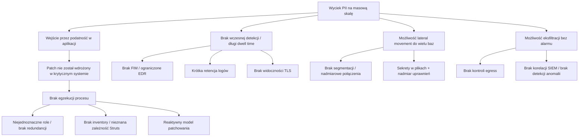

> **Uwaga metodologiczna.** Ten wpis jest analizą i syntezą publicznie znanych ustaleń śledztw oraz raportów poświęconych incydentowi Equifax. Zamiast przepisywać źródła, rekonstruuję zdarzenia i wnioski w formie autorskiej, „inżynierskiej” narracji: co się stało, dlaczego procesy zawiodły, jakie mechanizmy obronne powinny były zadziałać oraz jak przełożyć lekcje na kontrolki i architekturę.  

# Dlaczego Equifax stał się „przypadkiem kanonicznym”

W świecie bezpieczeństwa informacji są incydenty "głośne" i są incydenty "kanoniczne". Te pierwsze szybko znikają z nagłówków. Te drugie wracają w prezentacjach, audytach i dyskusjach o governance, bo odsłaniają *systemową* naturę problemu: nie pojedynczą lukę, lecz kaskadę zaniedbań w procesach, odpowiedzialnościach, technologii i kulturze organizacyjnej.
{:.text-justify}

Włamanie do Equifax z 2017 roku jest kanoniczne z trzech powodów:

1. **Skala danych i konsekwencje społeczne.** Ujawnienie danych identyfikacyjnych (PII) na poziomie setek milionów rekordów czyni incydent problemem infrastruktury zaufania, nie tylko problemem jednej firmy. 
2. **Prosty punkt wejścia i długi czas przebywania.** Wektor wejścia opierał się o publicznie opisaną podatność w popularnym komponencie aplikacyjnym, a mimo to atakujący utrzymali się w środowisku przez wiele tygodni/miesięcy.
3. **Dominacja błędów organizacyjnych nad „czystą techniką”.** Technika była ważna, ale to *procesy* (patch management, asset inventory, monitoring, log retention, segmentacja, odpowiedzialności) zdecydowały o rozmiarze szkód.
{:.text-justify}

W tym wpisie rozkładam incydent na części: od modelu biznesowego Equifax i "atrakcyjności" celu, przez oś czasu i łańcuch ataku, po źródła podatności wewnątrz organizacji i praktyczne wnioski wdrożeniowe.
{:.text-justify}

---

# Equifax jako organizacja: dlaczego to był łakomy cel

Equifax to jedna z głównych amerykańskich agencji raportowania kredytowego. Jej przewaga biznesowa wynika z dostępu do ogromnych zasobów danych o konsumentach i przedsiębiorstwach oraz z analityki, która z danych buduje ocenę ryzyka kredytowego, narzędzia decyzji, produkty antyfraudowe i usługi weryfikacji tożsamości. W praktyce oznacza to:

- duże, długowieczne systemy (często o rodowodzie „legacy”),
- skomplikowane integracje z bankami, instytucjami publicznymi i klientami B2B,
- presję na dostępność i ciągłość działania,
- oraz bardzo wysoki „koszt błędu” w obszarze poufności i integralności.

W takim modelu biznesowym bezpieczeństwo nie jest „dodatkiem”. Jest warunkiem utrzymania licencji społecznej do działania: konsumenci nie wybierają dobrowolnie, czy Equifax ma ich dane, a mimo to firma jest zobowiązana do ich ochrony na poziomie odpowiadającym krytyczności aktywów.

---

# Oś czasu incydentu: od ostrzeżenia do ujawnienia

Najważniejszą kompetencją przy analizie incydentów jest umiejętność rozróżnienia trzech osi czasu:

- **czas podatności** (kiedy luka stała się znana i łatwa do wykorzystania),
- **czas intruzji i eskalacji** (kiedy atakujący wchodzą, utrzymują się, rozszerzają dostęp),
- **czas organizacyjnej reakcji** (kiedy wykryto, eskalowano, poinformowano interesariuszy).

W Equifax te osie rozjechały się dramatycznie.

## Kluczowe zdarzenia w skrócie

- **6 marca 2017:** opublikowano informacje o podatności w Apache Struts wraz z poprawką.
- **8 marca:** ostrzeżenia rozesłane przez podmioty branżowe i rządowe trafiają do organizacji.
- **9 marca:** wewnętrzna dystrybucja alertu; zgodnie z polityką krytyczne łatki powinny być wdrożone szybko (w praktyce: w ciągu dwóch dób).
- **10 marca:** pierwsze rozpoznanie i wejście do środowiska przez atakujących.
- **13 maja:** początek masowego pozyskiwania danych.
- **29–30 lipca:** wykrycie podejrzanego ruchu i odcięcie portalu, który był punktem wejścia.
- **sierpień:** dochodzenie forensyczne i stopniowa eskalacja informacji w kierunku kierownictwa i rady.
- **7 września:** publiczne ujawnienie incydentu.

Poniżej ta sama oś czasu w formie diagramu (możesz wkleić do Jekylla; wymaga włączonego renderowania Mermaid):


timeline
    title Equifax 2017 — oś czasu (upraszczająca)
    2017-03-06 : Publikacja informacji o podatności Apache Struts + poprawka
    2017-03-08 : Ostrzeżenia branżowe / CERT trafiają do organizacji
    2017-03-09 : Dystrybucja alertu wewnętrznie; wymagane szybkie patchowanie
    2017-03-10 : Pierwsze wejście atakujących („entry crew”)
    2017-05-13 : Start pozyskiwania PII z baz
    2017-07-29 : Reaktywacja widoczności SSL; wykrycie podejrzanego ruchu
    2017-07-30 : Portal sporu (ACIS) offline; przerwanie wektora dostępu
    2017-09-07 : Publiczne ujawnienie incydentu


---

# Łańcuch ataku: jak technicznie „poszło” włamanie

W analizie bezpieczeństwa często popełnia się błąd: sprowadza się incydent do jednego zdania („nie załatali Struts”). To kuszące, bo daje prostą lekcję. Problem w tym, że ta lekcja jest niepełna. „Nie załatali Struts” to *przyczyna konieczna*, ale nie *wystarczająca* do katastrofy tej skali.

Poniżej rekonstruuję logiczny kill chain w kategoriach praktycznych kontrol: gdzie powinno było zadziałać „coś” i nie zadziałało.

## 1) Initial Access: podatność w warstwie web aplikacji (Apache Struts)

Apache Struts był używany jako element middleware w portalu umożliwiającym konsumentom zgłaszanie sporów dotyczących danych w raporcie kredytowym (często opisywany jako ACIS — Automated Consumer Interview System). Podatność pozwalała na zdalne wykonanie kodu po stronie serwera (w praktyce: przejęcie aplikacji). Kluczowe było to, że:

- podatność była nagłośniona,
- istniały publiczne exploity,
- skanowanie Internetu pod kątem niezałatanych instancji było trywialne.

W nowoczesnych organizacjach to moment, w którym działają dwa równoległe procesy:

- **patch management** (wdrożenie poprawki),
- **virtual patching / WAF / IPS** (tymczasowa ochrona, gdy wdrożenie poprawki wymaga okna serwisowego).

W Equifax wdrożono pewne reguły ochronne, ale patchowanie w krytycznym miejscu zawiodło.

## 2) Persistence: web shells i wiele backdoorów

Po wejściu do środowiska atakujący osadzili web shells (skrypty umożliwiające zdalne sterowanie), a następnie utrzymywali wiele niezależnych „wejść” z różnych adresów. To jest klasyczny wzorzec APT: redundancja i dywersyfikacja punktów dostępu.

W tym miejscu **FIM (file integrity monitoring)** powinien był wykryć nieautoryzowane zmiany w plikach aplikacji/serwera. Brak FIM na krytycznym systemie oznaczał, że atakujący mogli pisać na dysku aplikacji bez natychmiastowego alarmu.

## 3) Credential Access: dane dostępowe w plikach konfiguracyjnych

Atakujący uzyskali dostęp do udziału plikowego, gdzie w plikach konfiguracyjnych znajdowały się niezaszyfrowane dane uwierzytelniające do innych zasobów. Taki błąd jest typowy dla systemów legacy i środowisk, w których sekretami „zarządza się” przez pliki, a nie przez vault i rotację.

W tym miejscu powinny były działać:

- **kontrole dostępu do zasobów administracyjnych** (least privilege),
- **secret management** (vault, szyfrowanie, rotacja, brak sekretów w plikach),
- **monitoring dostępu do udziałów plikowych** (nietypowe wzorce czytania).

## 4) Lateral Movement: brak segmentacji i nadmiarowe połączenia do baz

Portal, który biznesowo potrzebował dostępu do niewielkiej liczby baz, miał łączność do znacznie szerszego zestawu zasobów. To otworzyło atakującym drogę do dziesiątek baz danych poza „strefą” portalu.

To klasyczna porażka dwóch praktyk:

- **segmentacji sieci / mikrosegmentacji** (strefy, kontrola egress/ingress),
- **modelowania połączeń aplikacji** (application dependency mapping) i redukcji zbędnych zależności.

## 5) Collection i Exfiltration: zapytania do baz i wynoszenie danych

Atakujący wykonywali tysiące zapytań do baz, identyfikując tabele zawierające PII, a następnie eksportując dane do plików, kompresując je i wynosząc na zewnątrz. W nowoczesnym środowisku sygnały ostrzegawcze w tej fazie to m.in.:

- nietypowy wolumen zapytań,
- nietypowe zapytania do metadanych,
- eksport dużych zestawów wyników,
- anomalie w ruchu wychodzącym.

W Equifax problemem była m.in. ograniczona widoczność ruchu szyfrowanego przez wygasłe certyfikaty w urządzeniach zapewniających widoczność SSL oraz krótka retencja logów.

---

# Diagram: „co powinno zadziałać” (kontrole vs fazy ataku)

Poniższy diagram to narzędzie dydaktyczne: mapuje fazy ataku na typowe kontrolki. Możesz użyć go jako check-listy do analizy własnej organizacji.


flowchart LR
    A[Initial Access: RCE w aplikacji] --> B[Persistence: web shells]
    B --> C[Credential Access: sekrety w plikach]
    C --> D[Lateral Movement: brak segmentacji]
    D --> E[Collection: masowe zapytania do baz]
    E --> F[Exfiltration: wynoszenie danych]

    A -. "Patch mgmt / SBoM / WAF" .-> A
    B -. "FIM / EDR na serwerach / hardening" .-> B
    C -. "Vault / rotacja sekretów / least privilege" .-> C
    D -. "Segmentacja / IAM / PAM / zero trust" .-> D
    E -. "DB activity monitoring / UEBA / DLP" .-> E
    F -. "Egress control / TLS inspection / SIEM + korelacja" .-> F


---

# „Źródła podatności” wewnątrz Equifax: dlaczego kontrolki nie działały

W raporcie z ustaleń dotyczących incydentu powtarza się kilka motywów. Każdy z nich osobno jest groźny; razem tworzą warunki do katastrofy.

## 1) Patch management „na honor”

W organizacjach dojrzałych patch management jest inżynierią procesową: inwentarz aktywów → ocena ekspozycji → priorytetyzacja → wdrożenie → walidacja → raportowanie do właścicieli ryzyka.

W Equifax wskazywano m.in. na:

- **brak redundancji w procesie powiadamiania i egzekucji** (jeśli ktoś „nie przekaże maila”, system nie ma zabezpieczeń),
- **niejednoznaczne role** (kto jest business owner, system owner, application owner),
- **reaktywny model patchowania** (łatki wdraża się, gdy już widać problem, a nie w rytmie publikacji aktualizacji),
- **brak wiarygodnej walidacji** (skany nie wykryły podatnej wersji → uznano, że „jest dobrze”),
- oraz **backlog tysięcy niezałatanych podatności**.

Ten obraz jest kluczowy: to nie „jeden patch” był problemem, tylko *system* podejmowania decyzji o patchowaniu.

### Wzorzec anty‑pattern: „skan nie widzi, więc nie istnieje”

W wielu środowiskach skanery podatności mają ograniczenia: nie widzą wszystkiego, mylą wersje, są oszukiwane przez nietypowe konfiguracje, nie docierają do segmentów sieci. Jeśli organizacja traktuje wynik skanu jako jedyną prawdę, buduje sobie fałszywe poczucie bezpieczeństwa.

Lepiej: skan + inwentarz + SBoM + ręczna walidacja krytycznych systemów + testy patchowania + metryki zgodności.

## 2) Brak pełnego inwentarza aktywów (asset inventory)

Nie da się zabezpieczać tego, czego się nie zna. Brak konsolidowanego inwentarza IT powoduje, że:

- nie wiesz, gdzie działa podatny komponent,
- nie wiesz, które systemy są krytyczne,
- nie wiesz, jakie zależności sieciowe są naprawdę potrzebne,
- nie potrafisz szybko „odciąć” tylko tego, co trzeba.

W Equifax brak pełnego inwentarza był istotny: osoby odpowiedzialne za dany system mogły nie wiedzieć, że komponent (Struts) w ogóle tam działa.

## 3) „Accountability gap”: podział IT i Security oraz reporting do działu prawnego

Struktura organizacyjna ma znaczenie techniczne. Jeżeli security definiuje „co”, a IT wdraża „jak”, ale komunikacja jest silosowa, to:

- security nie ma mocy sprawczej (nie może instalować/zmieniać),
- IT nie ma presji „ryzyka” (bo KPI są o dostępności i projektach),
- nikt nie jest „single throat to choke”.

W Equifax bezpieczeństwo raportowało do linii prawnej (CLO), a nie do CIO lub bezpośrednio do CEO/board w modelu równorzędnym. Taki układ jest spotykany rzadziej i zwiększa ryzyko, że decyzje technologiczne nie będą skutecznie egzekwowane.

Poniżej prosta ilustracja problemu:

```mermaid
flowchart TB
    CEO[CEO] --> CIO[CIO (IT)]
    CEO --> CLO[CLO (Legal)]
    CLO --> CSO[CSO / Security]
    CIO --> ITOPS[IT Ops / System owners]
    CSO -. "definiuje wymagania" .-> ITOPS
    ITOPS -. "wdraża w infrastrukturze" .-> CSO

    subgraph Problem
      direction TB
      Gap["Accountability gap: silosy + brak wspólnego właściciela ryzyka"]
    end

    CSO --> Gap
    ITOPS --> Gap
```

## 4) Legacy i „technologiczny dług”: systemy trudne do patchowania i monitorowania

Jeżeli krytyczny portal ma rodowód sięgający dekad (a w praktyce jest utrzymywany przez niewielką grupę specjalistów), to każda zmiana jest ryzykowna operacyjnie. Wtedy organizacja wchodzi w tryb:

- „nie ruszaj, bo się zepsuje”,
- „zrobimy to w kolejnym kwartale”,
- „najpierw projekt modernizacyjny”.

To jest realny problem, ale nie jest usprawiedliwieniem. Dług technologiczny w systemach przetwarzających PII musi mieć **właściciela ryzyka** i **harmonogram spłaty** – inaczej prędzej czy później spłata nastąpi „w trybie kryzysu”.

## 5) Widoczność ruchu szyfrowanego i bałagan w certyfikatach

Jednym z bardziej symbolicznych elementów historii Equifax są wygasłe certyfikaty w urządzeniach zapewniających widoczność SSL. Jeśli takie urządzenie traci certyfikat, może nadal przepuszczać ruch, ale przestaje go odszyfrowywać i analizować. To oznacza „ślepotę” na poziomie, na którym dziś dzieje się większość ataków (HTTPS/TLS).

Nie chodzi tylko o jeden certyfikat: w tle jest brak procesu zarządzania cyklem życia certyfikatów w skali organizacji, co prowadzi do setek wygasłych elementów i braku pewności, gdzie masz „ciemne miejsca”.

## 6) Krótka retencja logów i brak FIM

W raporcie wielokrotnie wraca temat logów: jeśli trzymasz logi tylko 30 dni, a ataki ukierunkowane wykrywa się średnio po kilku miesiącach, to po prostu nie masz materiału dowodowego i telemetrycznego do skutecznej analizy. Bez logów SIEM jest „pusty”, a incident response zamienia się w zgadywanie.

Podobnie FIM: jeśli nie wykrywasz tworzenia web shelli i zmian w krytycznych plikach, to w praktyce pozwalasz atakującym na persistence bez alarmu.

---

# Reakcja na incydent: dlaczego komunikacja pogorszyła sytuację

Nawet jeśli incydent jest poważny, organizacja może ograniczyć szkody reputacyjne poprzez sprawną komunikację: szybkie ujawnienie, jasne instrukcje dla klientów, transparentność, minimalizacja „secondary harm” (np. phishingu). W Equifax było odwrotnie: część działań komunikacyjnych stała się kolejnym wektorem ryzyka.

Wśród problemów opisywanych w źródłach pojawiają się m.in.:

- **opóźnienie między wykryciem a ujawnieniem**, które wywołało zarzuty o brak transparentności,
- **domena i strona informacyjna**, które były łatwe do podszywania się i wprowadzały chaos (włącznie z pomyłkami w kanałach social),
- **problemy z bezpieczeństwem samej strony**, która zbierała dane od zaniepokojonych użytkowników,
- **kontrowersyjne warunki usługi** (w pewnym momencie pojawił się zapis o arbitrażu i rezygnacji z pozwów zbiorowych),
- **niedoszacowanie skali kontaktu z klientami** (gwałtowny wzrost zapytań, skargi na infolinię).

Ważna lekcja: *incident response to także product design i customer experience*. Jeśli portal „sprawdź, czy wyciekły Twoje dane” jest zrobiony na szybko, bez hardeningu, bez poprawnej domeny, bez ochrony antyphishingowej i bez gotowości call center, to kryzys staje się mnożnikiem szkód.

---

# Governance i rada nadzorcza: pytania, które powinny paść przed incydentem

Po incydencie zawsze łatwo powiedzieć: „rada powinna była zapytać”. Trudniej zbudować mechanizmy, które sprawią, że rada *ma dane*, by pytać sensownie.

W Equifax istniał komitet technologiczny rady, co na papierze sugeruje dojrzałość. Mimo to, incydent ujawnił, że:

- część krytycznych ryzyk była znana (np. patching, certyfikaty, brak segmentacji),
- ale nie była domykana w sposób mierzalny,
- a eskalacja informacji do rady w trakcie incydentu miała opóźnienia.

Jeśli chcesz przełożyć to na praktykę, poniższa lista to minimalny zestaw pytań dla rady/zarządu w organizacji przetwarzającej PII na dużą skalę:

1. Czy mamy **kompletny, aktualny inwentarz aktywów** (w tym zależności aplikacyjnych)?
2. Jak wygląda **SLA patchowania** dla komponentów internet‑facing? Ile systemów jest poza SLA?
3. Czy potrafimy **zweryfikować** skuteczność patchowania niezależnie (nie tylko „skan powiedział”)?
4. Czy mamy **FIM/EDR** na kluczowych serwerach aplikacyjnych? Jakie są wyjątki i dlaczego?
5. Jak długo trzymamy **logi** i czy to wspiera MTTD/MTTR dla ataków ukierunkowanych?
6. Czy mamy **segmentację** według funkcji biznesowej i minimalnych zależności?
7. Jak wygląda **zarządzanie certyfikatami** i widoczność TLS? Ile certyfikatów wygasa w 30 dni?
8. Czy mamy przećwiczone scenariusze kryzysowe: komunikacja, phishing, call center, portal informacyjny?
9. Jakie są metryki ryzyka: **KRIs**, wyniki audytów, i czy są powiązane z odpowiedzialnością (RACI)?

---

# Konsekwencje: koszty, regulacje, utrata zaufania

Incydenty tej skali mają trzy warstwy konsekwencji:

1. **koszty bezpośrednie**: forensics, kancelarie, call center, monitoring kredytowy, modernizacja,
2. **koszty prawne i regulacyjne**: pozwy, ugody, postępowania,
3. **koszty rynkowe**: spadek kursu, trudniejszy dostęp do kontraktów, utrata reputacji.

W Equifax obserwowano gwałtowną reakcję rynku (spadek kursu) oraz szereg dochodzeń i pozwów. W warstwie regulacyjnej incydent stał się paliwem dla dyskusji o „reżimie” nadzoru nad agencjami kredytowymi oraz o terminach i zasadach ujawniania naruszeń.

---

# Lekcje wdrożeniowe: jak nie powtórzyć Equifax w swojej organizacji

Poniżej przechodzę z historii do praktyki. Ta część jest celowo „operacyjna”: jeśli jesteś CISO, architektem bezpieczeństwa albo prowadzisz zajęcia, możesz ją potraktować jako zestaw wymagań i ćwiczeń.

## A. Patch management jako system: 7 reguł, które muszą być spełnione

1. **Inwentarz aktywów jest warunkiem.** Jeśli nie masz asset inventory, patch management jest loterią.
2. **SBoM i identyfikacja komponentów.** W 2026 roku nie wystarczy wiedzieć „jaka aplikacja”. Trzeba wiedzieć „jakie biblioteki” i „jakie wersje”.
3. **SLA dla internet‑facing i krytycznych.** Krytyczne RCE w komponentach webowych to tryb pilny, nie tygodniowy.
4. **RACI i pojedynczy właściciel ryzyka.** Zawsze musi być ktoś, kto „odpowiada”, nie tylko „wspiera”.
5. **Walidacja po wdrożeniu.** „Zainstalowane” nie znaczy „działa”. Waliduj: wersja, konfiguracja, regresja.
6. **Virtual patching jako most.** WAF/IPS/feature flags/odcięcie endpointu – to ma działać, gdy patch wymaga czasu.
7. **Raportowanie do biznesu.** Patchowanie to ryzyko biznesowe. Raportuj w języku ryzyka: ekspozycja, krytyczność, trend.

## B. Widoczność i detekcja: co musi działać, żebyś nie był „ślepy”

Minimalny zestaw:

- **FIM** na krytycznych systemach aplikacyjnych (wykrywanie web shelli, zmian w konfiguracji, nowych binarek),
- **EDR** (tam gdzie możliwe) oraz hardening serwerów,
- **centralny SIEM** z retencją logów wspierającą dochodzenie (nie 30 dni, lecz miesiące),
- **DB activity monitoring / audit logs** dla baz z PII,
- **monitoring ruchu wychodzącego** i kontrola egress,
- **TLS visibility** (lub alternatywne mechanizmy telemetryczne) + zarządzanie certyfikatami.

### Retencja logów: praktyczna reguła

Jeśli nie wiesz, jaką retencję przyjąć, zacznij od 180 dni dla systemów krytycznych i 90 dni dla pozostałych, a następnie dopasuj do kosztu i profilu ryzyka. Najważniejsze: miej to świadomie ujęte jako kontrola i KPI.

## C. Segmentacja i redukcja zależności

Zasada: portal o określonej funkcji biznesowej powinien komunikować się tylko z tymi bazami/usługami, które są niezbędne. Reszta to „otwarte drzwi”.

W praktyce oznacza to:

- mapowanie zależności aplikacji (automaty + warsztaty),
- polityki sieciowe „default deny” między strefami,
- mikrosegmentację / identity-based segmentation w środowiskach nowoczesnych,
- regularne „cięcie” zbędnych połączeń (security debt backlog).

## D. Sekrety i dane dostępowe

Zakaz „sekretów w plikach” powinien być *egzekwowalny*. Nie tylko jako polityka, ale jako pipeline:

- repo scanning (secret scanning),
- runtime scanning i alerty na użycie statycznych sekretów,
- vault + dynamic secrets tam, gdzie się da,
- rotacja i przeglądy uprawnień,
- PAM dla kont uprzywilejowanych.

## E. Incident response i komunikacja: przygotuj produkt, zanim będzie potrzebny

Z perspektywy Equifax ważne są dwa elementy:

1. **Portal kryzysowy** jest produktem przetwarzającym dane. Musi przejść hardening, threat modeling i testy obciążeniowe zanim kiedykolwiek będzie potrzebny.
2. **Phishing i podszywanie** to domyślne zjawisko po ujawnieniu wycieku. Musisz mieć strategię domen, DMARC/SPF/DKIM, komunikaty, monitoring brand abuse.

---

# Praktyczne ćwiczenie: „mini‑audyt Equifax” dla Twojej organizacji

Jeżeli chcesz zrobić z tego wpisu materiał szkoleniowy, wykorzystaj poniższy scenariusz:

**Założenie:** Twoja organizacja posiada internetowy portal dla klientów, który przetwarza PII i komunikuje się z kilkoma bazami danych.  

**Zadanie:** Odpowiedz na pytania w 60 minut, a następnie stwórz plan działań na 90 dni.

### Pytania kontrolne

1. Jak szybko potrafisz wskazać wszystkie systemy z komponentem Struts (lub analogicznym frameworkiem) i ich wersje?
2. Czy wiesz, które systemy są internet‑facing, a które tylko wewnętrzne?
3. Jaki masz SLA patchowania dla „critical RCE”? Ile systemów jest poza SLA?
4. Czy masz FIM/EDR na serwerach aplikacyjnych? Jakie są wyjątki?
5. Jaką masz retencję logów web i aplikacji? Czy pokrywa realny czas wykrycia APT?
6. Czy portal ma minimalne zależności sieciowe? Czy jest segmentowany?
7. Czy w konfiguracji aplikacji istnieją statyczne sekrety? Jak to weryfikujesz?
8. Czy umiesz wykryć masowe zapytania do baz i eksfiltrację?
9. Czy masz gotowy portal kryzysowy i plan komunikacji? Czy był ćwiczony?

### 90‑dniowy plan naprawczy (szkic)

- Tydzień 1–2: inwentarz internet‑facing + komponenty krytyczne + szybkie „gap analysis”.
- Tydzień 3–4: SLA patchowania + automatyzacja walidacji + wprowadzenie virtual patching.
- Miesiąc 2: segmentacja portalu + ograniczenie połączeń + DB audit logging.
- Miesiąc 3: FIM/EDR na krytycznych serwerach + retencja logów + ćwiczenie IR + portal kryzysowy.

---

# Mapowanie do ram NIST CSF i ISO 27001

Dla zespołów GRC przydatne jest „tłumaczenie” incydentu na domeny kontrolne. Poniżej mapowanie wysokopoziomowe.

## NIST CSF (Identify / Protect / Detect / Respond / Recover)

- **Identify:** brak inwentarza aktywów i zależności, niedojrzałe zarządzanie ryzykiem łańcucha komponentów.
- **Protect:** patch management, zarządzanie sekretami, segmentacja, hardening, kontrola dostępu.
- **Detect:** brak FIM, zbyt krótka retencja logów, ograniczona widoczność TLS, niewystarczająca korelacja.
- **Respond:** opóźnienia i problemy komunikacyjne, chaotyczne narzędzia dla użytkowników, skala obsługi klienta.
- **Recover:** modernizacja, wzmocnienie governance, program naprawczy, zmiany personalne i procesowe.

## ISO 27001 (intuicyjne wskazania)

- zarządzanie aktywami (inwentarz),
- zarządzanie podatnościami i zmianą,
- bezpieczeństwo operacyjne (logowanie, monitoring),
- kontrola dostępu i zarządzanie uprawnieniami,
- bezpieczeństwo w rozwoju i utrzymaniu (SDLC / DevSecOps),
- zarządzanie incydentami,
- relacje z dostawcami i narzędziami (np. forensics, monitoring).

---

# Co bym zrobił „jutro rano”, gdybym był CISO po Equifax

Na koniec – praktyczna lista działań, które mają sens jako pierwsze 10 ruchów po przejęciu odpowiedzialności w organizacji, która ma podobny profil ryzyka:

1. **Zamknąć pętlę patchowania**: inwentarz → SLA → wdrożenie → walidacja → raport.
2. **Zredukować ekspozycję internet‑facing**: minimalizacja endpointów, WAF, rate limiting, izolacja.
3. **Włączyć FIM na krytycznych serwerach** (lub wprowadzić alternatywne mechanizmy monitorowania zmian).
4. **Wydłużyć retencję logów** i zbudować zestaw korelacji pod ataki na aplikacje web.
5. **Rozpisać segmentację**: strefy + minimalne zależności + monitoring ruchu między strefami.
6. **Ucywilizować sekrety**: vault, rotacja, brak haseł w plikach.
7. **Wprowadzić metryki MTTD/MTTR** i ćwiczenia IR co kwartał.
8. **Przygotować portal kryzysowy** jako produkt: domeny, DMARC, hardening, CDN, WAF, testy.
9. **Zbudować governance**: rada/zarząd dostaje KRIs co miesiąc, nie „po incydencie”.
10. **Zidentyfikować i spłacać dług technologiczny** w systemach przetwarzających PII (z budżetem i terminami).

---

# Źródła i dalsza lektura

Wpis bazuje na analizie raportów i materiałów publicznych streszczonych w opracowaniu case study, w tym ustaleniach komisji kongresowych dotyczących przyczyn i przebiegu włamania, problemów patch management, braków w monitoringu (FIM, retencja logów), zarządzania certyfikatami oraz błędów w komunikacji kryzysowej.


---

# Aneks A: „Referencyjna architektura” ochrony portalu PII

Ta sekcja jest intencjonalnie gęsta technicznie. Jeżeli prowadzisz blog dla studentów i praktyków, możesz ją zostawić w całości; jeśli piszesz dla menedżerów, rozważ skrócenie.

## A1. Warstwa brzegowa (Edge) i ochrona aplikacji

**Cel:** ograniczyć prawdopodobieństwo udanego RCE i utrudnić automatyczne skanowanie.

Elementy:

- CDN / reverse proxy z ochroną DDoS,
- WAF z regułami pod CVE klasy RCE (virtual patching),
- rate limiting, bot management,
- wymuszenie TLS i poprawnych konfiguracji (HSTS, nowoczesne ciphers),
- izolacja domen (portal kryzysowy w osobnej strefie).

**Wymaganie praktyczne:** jeśli w piątek po południu pojawi się krytyczny CVE w popularnym frameworku webowym, powinieneś móc w 2–4 godziny uruchomić reguły WAF, a w 24–48 godzin wdrożyć patch.

## A2. Warstwa aplikacji: hardening i kontrola zmian

- nieuruchamianie zbędnych modułów,
- nieprzechowywanie sekretów w plikach konfiguracyjnych,
- podpisane artefakty (supply chain),
- „immutability” gdzie się da (kontenery/VM z kontrolą driftu),
- FIM: alerty na tworzenie/zmianę plików w katalogach aplikacji,
- EDR / telemetryka procesów i sieci.

## A3. Warstwa danych: minimalizacja i monitoring aktywności w bazach

- zasada najmniejszych uprawnień na poziomie DB (role per funkcja),
- rozdział kont aplikacyjnych, brak „shared admin”,
- audit logs: kto, kiedy, do jakich tabel i jakie wolumeny,
- alerty na masowe SELECT, eksporty, nietypowe zapytania do metadanych,
- szyfrowanie danych „at rest” tam, gdzie jest realne i nie rozwala zgodności (z pełną świadomością, że szyfrowanie nie zastępuje kontroli dostępu).

## A4. Segmentacja i kontrola ruchu

- strefa DMZ / app zone / data zone,
- „default deny” między strefami,
- egress control z serwerów aplikacyjnych (aplikacja nie powinna „wychodzić” dokądkolwiek),
- mTLS lub identity-aware proxy w środowiskach nowoczesnych.

## A5. Logowanie i SIEM: telemetria jako produkt

- retencja 90–180 dni,
- normalizacja i korelacja,
- scenariusze detekcji: web shells, anomalie w DB, nietypowe egress,
- testy: „czy alert się odpala?” (purple teaming).

---

# Aneks B: Checklista audytowa (skrót) — do wykorzystania na zajęciach

## B1. Patch management i podatności

- [ ] Inwentarz aktywów obejmuje aplikacje, serwery, bazy, komponenty biblioteczne.
- [ ] SLA patchowania dla krytycznych CVE jest zdefiniowane i mierzone.
- [ ] Po wdrożeniu łatki istnieje walidacja skuteczności (nie tylko skan).
- [ ] Istnieje mechanizm „virtual patching” dla sytuacji bez okna serwisowego.
- [ ] Backlog podatności jest zarządzany w oparciu o ryzyko, nie kolejkę.

## B2. Monitoring i detekcja

- [ ] FIM na krytycznych systemach jest włączony i działa (alerty trafiają do SOC).
- [ ] Retencja logów umożliwia dochodzenia w horyzoncie miesięcy.
- [ ] TLS visibility lub alternatywna telemetria zapewnia obserwowalność ruchu szyfrowanego.
- [ ] DB audit logs są zbierane i korelowane z tożsamością i kontekstem.

## B3. Segmentacja i dostęp

- [ ] Aplikacje mają minimalne wymagane połączenia do baz/usług.
- [ ] Sieć jest segmentowana, a ruch między strefami jest monitorowany.
- [ ] Sekrety są w vault, nie w plikach; istnieje rotacja i przeglądy.

## B4. Incident response i komunikacja

- [ ] Jest plan IR i ćwiczenia przynajmniej kwartalne.
- [ ] Portal kryzysowy ma threat model, hardening i testy.
- [ ] Domeny, DMARC/SPF/DKIM i monitoring podszywania są przygotowane.
- [ ] Call center i wsparcie klienta ma scenariusze i skalowanie.

---

# Aneks C: Pytania egzaminacyjne / dyskusyjne (dla studentów)

1. Dlaczego brak inwentarza aktywów jest „pierwszą przyczyną” wielu incydentów, mimo że nie jest „hakowaniem”?
2. Jakie są wady modelu „patchujemy tylko, gdy skaner pokaże podatność”?
3. Jakie sygnały telemetryczne mogłyby wykryć web shell w portalu?
4. Dlaczego wygasły certyfikat w urządzeniu monitorującym TLS jest ryzykiem operacyjnym, a nie tylko „błędem administracyjnym”?
5. Jak opóźnienie ujawnienia incydentu wpływa na ryzyko wtórne (phishing, fraud)?
6. W jaki sposób struktura raportowania CSO/CSO wpływa na skuteczność egzekucji polityk bezpieczeństwa?
7. Zaproponuj minimalny zestaw kontrol „zero trust” dla portalu PII.
8. Jakie metryki (KPI/KRI) raportowałbyś do zarządu, aby nie obudzić się po fakcie?

---

# Aneks D: Słownik pojęć (krótko)

- **ACIS** – system/portal umożliwiający konsumentom zgłaszanie sporów; w analizach incydentu opisywany jako krytyczny punkt wejścia.
- **FIM (File Integrity Monitoring)** – kontrola integralności plików; wykrywa nieautoryzowane zmiany.
- **Web shell** – skrypt pozostawiający furtkę do zdalnego sterowania serwerem aplikacji.
- **Virtual patching** – tymczasowa ochrona (np. WAF/IPS) blokująca exploit bez instalacji łatki.
- **Retencja logów** – jak długo trzymasz logi; kluczowa dla dochodzeń i detekcji APT.
- **Segmentacja** – podział sieci na strefy minimalizujący skutki kompromitacji jednej aplikacji.


---

# Aneks E: Głębsza analiza „mechaniki porażki” — 12 wzorców organizacyjnych

Poniższe wzorce to nie „opis Equifax jako wyjątku”, tylko katalog zachowań, które spotyka się w wielu firmach. Incydent działa tu jak soczewka: powiększa i ujawnia słabości, które w codziennej pracy są maskowane przez szczęście, małą liczbę prób włamania albo brak determinacji atakujących.

## E1. „Bezpieczeństwo jest projektem, nie procesem”

Organizacje często inwestują w bezpieczeństwo falami: po audycie, po incydencie, po wymaganiu klienta. Wtedy kupuje się narzędzie, robi wdrożenie, spisuje dokument, po czym temat schodzi z agendy. Tymczasem bezpieczeństwo w systemach internet‑facing jest procesem ciągłym. Jeśli patch management i monitoring nie są rutyną mierzoną metrykami, to w praktyce zależą od heroizmu pojedynczych ludzi.

## E2. „Ryzyko rozmyte w macierzy”

Jeśli za patch odpowiada „system owner”, za okno serwisowe „business owner”, a za walidację „application owner”, ale nikt nie ma wspólnej odpowiedzialności za wynik, to w praktyce odpowiedzialność znika. W krytycznych domenach trzeba projektować RACI tak, aby istniał *jeden właściciel ryzyka*, który raportuje ekspozycję i podejmuje decyzje.

## E3. „Legacy jako świętość”

Systemy legacy bywają traktowane jak artefakty: nikt nie dotyka, bo nie ma testów, bo ryzyko regresji, bo brak kompetencji. Wtedy organizacja żyje w „strefie braku zmiany”, w której atakujący mają przewagę: oni mogą eksperymentować bez ograniczeń, a obrońcy boją się ruszyć konfigurację.

## E4. „Brak telemetrii = brak faktów”

Gdy logi są krótkie, rozproszone albo niekompletne, każdy incydent zamienia się w debatę o opiniach. Ktoś „wydaje się” pamiętać, że patch był zrobiony. Ktoś „wydaje się” widzieć w skanie, że nie ma podatności. Bez telemetrii i walidacji organizacja zarządza bezpieczeństwem na podstawie narracji, nie danych.

## E5. „Kultura maila”

Jeśli krytyczna informacja o podatności jest dystrybuowana mailem bez mechanizmu potwierdzenia, bez automatycznego taskowania, bez eskalacji i bez audytu, to jest to proces o jakości komunikatora, a nie procesu kontrolnego. To nie jest „wina człowieka”, tylko projekt procesu.

## E6. „WAF jako alibi”

Czasem organizacje traktują WAF jako „uspokojenie sumienia”: skoro jest WAF, to można patchować wolniej. To błąd. WAF jest warstwą obronną, ale nie jest dowodem braku ryzyka. Virtual patching ma być mostem, nie stałym substytutem.

## E7. „Brak minimalizacji danych”

Agencje kredytowe i podobne instytucje często mają argument biznesowy, aby trzymać dużo danych. Niemniej w każdej organizacji istnieje możliwość redukcji ryzyka poprzez minimalizację: ograniczanie pól w systemach pomocniczych, tokenizację identyfikatorów, separację stref danych i ograniczenie dostępu. Nawet jeśli nie zminimalizujesz zbioru, możesz zminimalizować powierzchnię dostępu.

## E8. „Użytkownik końcowy jako ofiara wtórna”

Po ujawnieniu wycieku użytkownicy stają się celem phishingu i oszustw. Jeśli firma komunikuje się niespójnie, używa mylących domen albo tworzy słabo zabezpieczone portale, wzmacnia skutki wtórne. Dlatego komunikacja kryzysowa jest elementem bezpieczeństwa.

## E9. „Brak ćwiczeń i „zimny start””

Incident response bez ćwiczeń to zimny start w środku pożaru. Kiedy wchodzi presja czasu, ludzie robią to, co znają: improwizują. Ćwiczenia budują pamięć mięśniową: kto dzwoni do kogo, jakie są progi eskalacji, jak działa triage, jak wygląda decyzja o ujawnieniu.

## E10. „Nieciągłość kompetencji”

Jeżeli kluczowe systemy utrzymuje mała grupa ekspertów, a rotacja w security/IT jest duża, powstaje luka kompetencyjna. To ryzyko organizacyjne – tak samo realne jak CVE. Rozwiązanie: dokumentacja, automatyzacja, testy, sukcesja, oraz program modernizacji.

## E11. „Brak segmentacji jako kompromis dla wygody”

Segmentacja bywa „niewygodna”: utrudnia projekty, wymaga mapowania zależności, czasem ujawnia chaotyczną architekturę. Właśnie dlatego jest potrzebna. Brak segmentacji nie jest neutralny – jest decyzją o tym, że kompromitacja jednego portalu może dać dostęp do wielu zasobów.

## E12. „Board visibility bez board accountability”

Posiadanie komitetu technologicznego lub raportu kwartalnego nie oznacza, że ryzyko jest kontrolowane. Widoczność jest warunkiem koniecznym, ale dopiero odpowiedzialność (np. KPI/KRI, budżet, terminy, konsekwencje) sprawia, że problemy są domykane.

---

# Aneks F: Jak pisać wymagania bezpieczeństwa, aby były egzekwowalne

Na koniec praktyczna technika: jeśli chcesz uniknąć „papierowego bezpieczeństwa”, wymagania muszą mieć:

- **zakres** (które systemy),
- **metrykę** (co mierzymy),
- **próg** (kiedy jest OK, a kiedy nie),
- **właściciela** (kto odpowiada),
- **dowód** (jak audytujemy).

Przykład:

- *Wymaganie:* krytyczne podatności RCE w komponentach internet‑facing muszą być załatane w 48 godzin.  
- *Metryka:* % systemów internet‑facing z krytycznymi CVE poza SLA.  
- *Próg:* 0% (wyjątki wymagają akceptacji ryzyka przez właściciela biznesowego).  
- *Właściciel:* Head of Platform / CIO + CISO (wspólny).  
- *Dowód:* raport z CMDB/SBoM + wynik walidacji wersji + wpis w systemie zmian.

Takie sformułowania są trudniejsze, ale realnie prowadzą do poprawy.

## FAQ 1: Czy WAF „wystarczy”, aby uniknąć Equifax?

Nie. Pojedyncza kontrola jest tylko warstwą. W Equifax problemem była kaskada: brak pełnego inwentarza, niejednoznaczny RACI, niedojrzały patch management, braki w monitoringu (FIM, logi), ograniczona widoczność TLS i brak segmentacji. Dlatego myśl o bezpieczeństwie jak o systemie: kontrolki muszą być spójne, mierzone i domykane właścicielstwem ryzyka.


## FAQ 2: Czy EDR „wystarczy”, aby uniknąć Equifax?

Nie. Pojedyncza kontrola jest tylko warstwą. W Equifax problemem była kaskada: brak pełnego inwentarza, niejednoznaczny RACI, niedojrzały patch management, braki w monitoringu (FIM, logi), ograniczona widoczność TLS i brak segmentacji. Dlatego myśl o bezpieczeństwie jak o systemie: kontrolki muszą być spójne, mierzone i domykane właścicielstwem ryzyka.


## FAQ 3: Czy SIEM „wystarczy”, aby uniknąć Equifax?

Nie. Pojedyncza kontrola jest tylko warstwą. W Equifax problemem była kaskada: brak pełnego inwentarza, niejednoznaczny RACI, niedojrzały patch management, braki w monitoringu (FIM, logi), ograniczona widoczność TLS i brak segmentacji. Dlatego myśl o bezpieczeństwie jak o systemie: kontrolki muszą być spójne, mierzone i domykane właścicielstwem ryzyka.


## FAQ 4: Czy ISO 27001 „wystarczy”, aby uniknąć Equifax?

Nie. Pojedyncza kontrola jest tylko warstwą. W Equifax problemem była kaskada: brak pełnego inwentarza, niejednoznaczny RACI, niedojrzały patch management, braki w monitoringu (FIM, logi), ograniczona widoczność TLS i brak segmentacji. Dlatego myśl o bezpieczeństwie jak o systemie: kontrolki muszą być spójne, mierzone i domykane właścicielstwem ryzyka.


## FAQ 5: Czy NIST CSF „wystarczy”, aby uniknąć Equifax?

Nie. Pojedyncza kontrola jest tylko warstwą. W Equifax problemem była kaskada: brak pełnego inwentarza, niejednoznaczny RACI, niedojrzały patch management, braki w monitoringu (FIM, logi), ograniczona widoczność TLS i brak segmentacji. Dlatego myśl o bezpieczeństwie jak o systemie: kontrolki muszą być spójne, mierzone i domykane właścicielstwem ryzyka.


## FAQ 6: Czy segmentacja „wystarczy”, aby uniknąć Equifax?

Nie. Pojedyncza kontrola jest tylko warstwą. W Equifax problemem była kaskada: brak pełnego inwentarza, niejednoznaczny RACI, niedojrzały patch management, braki w monitoringu (FIM, logi), ograniczona widoczność TLS i brak segmentacji. Dlatego myśl o bezpieczeństwie jak o systemie: kontrolki muszą być spójne, mierzone i domykane właścicielstwem ryzyka.


## FAQ 7: Czy vault „wystarczy”, aby uniknąć Equifax?

Nie. Pojedyncza kontrola jest tylko warstwą. W Equifax problemem była kaskada: brak pełnego inwentarza, niejednoznaczny RACI, niedojrzały patch management, braki w monitoringu (FIM, logi), ograniczona widoczność TLS i brak segmentacji. Dlatego myśl o bezpieczeństwie jak o systemie: kontrolki muszą być spójne, mierzone i domykane właścicielstwem ryzyka.


## FAQ 8: Czy SBoM „wystarczy”, aby uniknąć Equifax?

Nie. Pojedyncza kontrola jest tylko warstwą. W Equifax problemem była kaskada: brak pełnego inwentarza, niejednoznaczny RACI, niedojrzały patch management, braki w monitoringu (FIM, logi), ograniczona widoczność TLS i brak segmentacji. Dlatego myśl o bezpieczeństwie jak o systemie: kontrolki muszą być spójne, mierzone i domykane właścicielstwem ryzyka.


## FAQ 9: Czy retencja logów „wystarczy”, aby uniknąć Equifax?

Nie. Pojedyncza kontrola jest tylko warstwą. W Equifax problemem była kaskada: brak pełnego inwentarza, niejednoznaczny RACI, niedojrzały patch management, braki w monitoringu (FIM, logi), ograniczona widoczność TLS i brak segmentacji. Dlatego myśl o bezpieczeństwie jak o systemie: kontrolki muszą być spójne, mierzone i domykane właścicielstwem ryzyka.


## FAQ 10: Czy ćwiczenia IR „wystarczy”, aby uniknąć Equifax?

Nie. Pojedyncza kontrola jest tylko warstwą. W Equifax problemem była kaskada: brak pełnego inwentarza, niejednoznaczny RACI, niedojrzały patch management, braki w monitoringu (FIM, logi), ograniczona widoczność TLS i brak segmentacji. Dlatego myśl o bezpieczeństwie jak o systemie: kontrolki muszą być spójne, mierzone i domykane właścicielstwem ryzyka.


---

# Aneks G: Patch management w praktyce — projekt procesu, nie slajd

W tej sekcji rozpisuję patch management „od kuchni”, w sposób, który łatwo przenieść na procedury, narzędzia i ćwiczenia ze studentami. Włamanie do Equifax jest świetnym przykładem, że sama polityka („krytyczne w 48h”) nic nie znaczy, jeżeli nie ma mechanizmu *wykonania*.

## G1. Cztery warstwy informacji: CVE → ekspozycja → krytyczność → okno zmiany

Gdy pojawia się krytyczny alert (np. RCE w popularnym frameworku), w organizacji powinny zadziałać cztery pytania w tej kolejności:

1. **Co dokładnie jest podatne?** (komponent, wersje, konfiguracje, warunki exploitu)
2. **Gdzie tego używamy?** (SBoM, CMDB, discovery, repozytoria artefaktów)
3. **Jak bardzo jesteśmy wystawieni?** (internet‑facing, segmenty sieci, WAF, auth, rate limits)
4. **Jak szybko możemy to bezpiecznie naprawić?** (okno serwisowe, testy regresji, rollout)

W Equifax problemem było m.in. to, że różne zespoły miały fragmenty tej wiedzy, ale nie było spójnego przepływu, który doprowadziłby do *zamknięcia* zadania.

## G2. Minimalny „pipeline” patchowania (w stylu DevSecOps)

Nawet w środowiskach niekontenerowych można wdrożyć podejście pipeline‑owe. Minimalny model wygląda tak:

1. **Intake**: alert trafia do systemu incydentów/ryzyk (nie do skrzynki mailowej).
2. **Triage**: klasyfikacja (CVSS to nie wszystko), identyfikacja warunków exploitu.
3. **Discovery**: automatyczne wyszukanie systemów z podatnym komponentem (SBoM/agent).
4. **Plan**: przypisanie właścicieli (RACI), plan okien, decyzje o virtual patchingu.
5. **Implementacja**: wdrożenie patcha przez IT/Platform.
6. **Walidacja**: testy (wersja, funkcjonalność, skan, smoke tests).
7. **Dowód**: zapis dowodu w systemie zgodności (audyt).
8. **Report**: metryki do CISO/CIO/zarządu.

Kluczowy element to kroki 6–8. Bez walidacji i dowodu patch management jest deklaracją.

## G3. RACI bez „dziur”: jak to napisać, żeby nie rozmyć odpowiedzialności

Wiele organizacji ma problem z tym, że „właściciel biznesowy” ma decydować o oknie, ale nie rozumie ryzyka, a „właściciel systemu” ma wdrażać patch, ale nie ma mandatu do przerwy w działaniu. Rozwiązaniem jest jasne rozpisanie decyzyjności:

- **Business owner**: akceptuje ryzyko i autoryzuje przerwę lub ryzyko tymczasowe (np. virtual patching).
- **System owner / Platform owner**: wykonuje zmianę i odpowiada za jakość wdrożenia.
- **Security (CISO/SOC)**: ocenia ryzyko, definiuje wymagania, weryfikuje dowód.
- **Change manager**: zapewnia, że proces ma ślad audytowy i eskalację.

Najgorszy wariant to „wszyscy odpowiadają”, bo wtedy nikt nie odpowiada.

## G4. „Virtual patching” — jak robić to odpowiedzialnie

Virtual patching jest potrzebny, ale ma pułapki. Aby nie stał się permanentnym usprawiedliwieniem braku patchowania:

- każde virtual patching powinno mieć **datę ważności**,
- powinno być powiązane z **konkretnym zadaniem** w backlogu,
- musi być monitorowane (czy reguły faktycznie blokują próby),
- nie może być jedyną ochroną dla systemów krytycznych w długim okresie.

W praktyce: wprowadź zasadę, że virtual patching bez patcha może trwać np. maksymalnie 14 dni bez podpisanej akceptacji ryzyka na poziomie dyrektorskim.

---

# Aneks H: Inwentarz aktywów i „wiedza o środowisku” — praktyczne techniki

Brak inwentarza to jeden z najczęstszych korzeni problemów bezpieczeństwa. W Equifax wątek rozproszonego i niekompletnego inventory pojawia się jako element wyjaśniający, dlaczego zespół mógł nie zidentyfikować, że konkretny system używa podatnego komponentu.

## H1. CMDB vs „rzeczywistość” — dlaczego wpisy się rozjeżdżają

CMDB bywa traktowane jako baza prawdy. Problem w tym, że bez automatycznego discovery CMDB staje się bazą życzeń. Najczęstsze przyczyny rozjazdu:

- projekty wdrażają nowe instancje bez aktualizacji CMDB,
- zespoły utrzymaniowe robią „szybkie” zmiany,
- środowiska chmurowe są dynamiczne,
- istnieją „shadow IT” i wyjątki.

Dlatego inwentarz musi być budowany na podstawie telemetryki: agentów, skanów, API chmurowych, analiz ruchu.

## H2. Trzy perspektywy inwentarza

Dojrzały inventory łączy trzy perspektywy:

1. **Inwentarz infrastruktury** (hosty, kontenery, VM, urządzenia sieciowe).
2. **Inwentarz aplikacji i zależności** (usługi, komponenty, połączenia).
3. **Inwentarz danych** (gdzie są PII, kto ma dostęp, jakie są przepływy).

Equifax pokazuje, że brak perspektywy 2 i 3 prowadzi do katastrofalnej ekspozycji: portal aplikacyjny ma dostęp do wielu baz, a organizacja nie ma świadomości, że jest to nadmiarowe.

## H3. SBoM jako praktyka, nie dokument

SBoM (Software Bill of Materials) bywa traktowany jako plik do compliance. W praktyce SBoM jest mechanizmem operacyjnym:

- gdy pojawia się CVE w bibliotece, potrafisz w minutach wskazać, które artefakty są dotknięte,
- potrafisz powiązać artefakt z systemem produkcyjnym,
- potrafisz zaplanować rollout.

W środowiskach Java (jak Struts) oznacza to m.in. widoczność zależności transytywnych.

---

# Aneks I: Logi, SIEM i forensics — jak uniknąć „braku dowodów”

W analizach incydentów często powtarza się fraza: „nie mogliśmy ustalić skali, bo brakowało logów”. To nie jest problem forensics, tylko problem architektury telemetrycznej.

## I1. Retencja logów a czas wykrycia

Jeśli ataki ukierunkowane wykrywa się po ~2–4 miesiącach, to retencja 30 dni jest niewystarczająca. Nawet jeśli masz świetny SOC, wiele sygnałów wymaga korelacji w czasie. Co więcej, logi są potrzebne nie tylko do wykrycia, ale do:

- zakresowania (scope) — które rekordy wyciekły,
- weryfikacji ścieżki ataku,
- eliminacji backdoorów,
- komunikacji z regulatorami i klientami.

Dlatego retencja powinna wynikać z ryzyka, nie z wygody.

## I2. Co logować w systemach webowych przetwarzających PII

Minimum:

- access logs (z identyfikatorem użytkownika/klienta, jeśli jest),
- audit logs aplikacji (akcje biznesowe, np. pobranie raportu, eksport),
- logi błędów i wyjątków (w tym stack traces, ale z kontrolą wycieków danych w logach),
- logi systemowe (procesy, połączenia sieciowe),
- logi WAF i reverse proxy,
- logi DB (audyt zapytań i wolumenów),
- logi IAM/PAM (logowania, eskalacje uprawnień).

Klucz: spójny format, korelacja (request ID), i centralizacja.

## I3. „TLS visibility” — kiedy, jak i dlaczego

Dyskusja o inspekcji TLS bywa trudna: prywatność, koszty, wydajność. Ale z perspektywy obrony przed eksfiltracją, brak widoczności TLS oznacza, że większość ruchu jest „czarną skrzynką”. Jeśli używasz urządzeń do odszyfrowywania/analizy, musisz mieć:

- proces zarządzania certyfikatami (skan, alerty, odnowienia),
- monitoring „ślepych punktów” (czy urządzenie faktycznie analizuje),
- oraz plan alternatywny (telemetria host‑based), jeśli TLS inspection jest ograniczone.

---

# Aneks J: Segmentacja „zwykła” i „zero trust” — praktyczne kompromisy

Segmentacja jest często blokowana przez argument: „to zbyt trudne”. W Equifax brak segmentacji był mnożnikiem szkód. Poniżej praktyczny sposób myślenia, który pozwala zacząć małymi krokami.

## J1. Segmentacja oparta o funkcję biznesową

Zacznij od stref:

- **Edge/DMZ**: reverse proxy, WAF, brzeg.
- **App zone**: serwery aplikacyjne.
- **Data zone**: bazy danych.
- **Admin zone**: narzędzia zarządzania, bastiony, PAM.
- **User zone**: stanowiska użytkowników.

Następnie wprowadź zasadę: ruch z App zone do Data zone jest dozwolony tylko do konkretnych baz/portów, z konkretnych tożsamości.

## J2. Mikrosegmentacja i „identity-based policy”

Jeżeli masz narzędzia mikrosegmentacji, możesz wprowadzić polityki oparte o tożsamość usługi (np. mTLS, SPIFFE/SPIRE) i wymuszać minimalne połączenia. Wtedy nawet jeśli atakujący przejmie jedną instancję, nie „pójdzie dalej” bez kolejnych przełamań.

## J3. Kontrola egress — najtańsza i najbardziej niedoceniana

Wiele eksfiltracji da się utrudnić, jeśli serwery aplikacyjne nie mogą wychodzić do Internetu dowolnie. Praktycznie:

- allowlist na DNS / IP dla koniecznych usług,
- blokada bezpośredniego egress,
- proxy z inspekcją i logowaniem.

To jest często tańsze niż pełna mikrosegmentacja, a daje szybki efekt.

---

# Aneks K: Komunikacja kryzysowa jako kontrola bezpieczeństwa

W Equifax elementy komunikacji (domena, portal, chaos informacyjny) zwiększały ryzyko wtórne. Dlatego komunikacja kryzysowa powinna być traktowana jak część programu bezpieczeństwa.

## K1. Projekt portalu kryzysowego

Portal powinien być przygotowany „na półce”:

- osobna domena, ale logicznie powiązana (czytelna i możliwa do zweryfikowania),
- SPF/DKIM/DMARC dla wszystkich domen komunikacji,
- WAF, CDN, rate limiting,
- minimalne zbieranie danych (nie pytaj o więcej niż potrzebne),
- jasne komunikaty antyphishingowe (jak rozpoznać fałszywe strony).

## K2. Call center i „capacity planning”

Jeżeli wiesz, że incydent dotyczy milionów użytkowników, to wiesz też, że kontakt z firmą wzrośnie skokowo. Plan kryzysowy musi uwzględniać:

- szybkie skalowanie obsługi,
- skrypty rozmów i odpowiedzi,
- szkolenie z phishingu i weryfikacji tożsamości,
- narzędzia do obsługi spraw.

## K3. Ujawnienie incydentu: równowaga między dochodzeniem a transparentnością

Organizacje czasem opóźniają ujawnienie, argumentując, że „muszą ustalić skalę”. To realne napięcie: zbyt wczesne ujawnienie może wprowadzić chaos, zbyt późne budzi nieufność. Rozwiązaniem jest przygotowanie „warstwowego” komunikatu:

- co wiemy teraz,
- czego nie wiemy,
- co robimy,
- co może zrobić użytkownik,
- kiedy kolejna aktualizacja.

---

# Aneks L: „Mapa przyczyn” — drzewo błędów prowadzących do katastrofy

Na koniec narzędzie analityczne: drzewo błędów (fault tree). Możesz je wykorzystać jako ćwiczenie: poproś studentów, aby dopisali własne gałęzie i zaproponowali kontrolki.



---

# Podsumowanie aneksów

Jeżeli miałbym sprowadzić Equifax do jednego zdania, brzmiałoby ono tak: **katastrofa zaczęła się od podatności, ale została umożliwiona przez słabości w procesach i architekturze, które pozwoliły atakowi trwać długo, rozszerzać się szeroko i pozostawić mało śladów.**

To dlatego Equifax jest tak dobrym studium przypadku: uczy, że bezpieczeństwo jest systemem zależności – technicznych i organizacyjnych.


---

# Aneks M: Metryki (KPI/KRI) — jak mierzyć, żeby zarząd rozumiał ryzyko

Jednym z ukrytych problemów w wielu organizacjach jest to, że bezpieczeństwo raportuje aktywność („wdrożyliśmy narzędzie”), a nie rezultat („zmniejszyliśmy ekspozycję”). Poniżej proponuję zestaw metryk, które realnie odpowiadają na pytanie: *czy jesteśmy bliżej, czy dalej od scenariusza Equifax?*

## M1. Metryki podatności i patchowania

1. **Exposure‑weighted vulnerability backlog**  
   Liczba podatności ważona ekspozycją (internet‑facing > internal) i krytycznością aktywów (PII > pozostałe).

2. **% systemów krytycznych poza SLA patchowania**  
   Z podziałem na klasy podatności (RCE, auth bypass, privesc).

3. **Mean Time To Patch (MTTP) dla „critical RCE”**  
   Najlepiej liczony osobno dla: internet‑facing / internal.

4. **% patchy zweryfikowanych niezależnie**  
   Czyli takich, dla których masz dowód wersji/konfiguracji, a nie tylko „zamknięty ticket”.

5. **Pokrycie SBoM i „time to impact analysis”**  
   Ile czasu zajmuje od CVE do wskazania dotkniętych usług.

## M2. Metryki detekcji i telemetryki

1. **MTTD / MTTR** dla incydentów w klasie „web compromise / data access”.
2. **Retencja logów** (dni) dla kluczowych źródeł: edge, app, DB, IAM.
3. **Pokrycie FIM/EDR** na serwerach krytycznych (% hostów).
4. **Pokrycie TLS visibility** albo alternatywnej telemetryki (np. eBPF/EDR) — z listą „ciemnych stref”.
5. **Liczba „high‑fidelity alerts” miesięcznie** oraz % alertów zakończonych „true positive”.

## M3. Metryki architektury i dostępu

1. **Liczba połączeń aplikacji do baz** (trend malejący = redukcja powierzchni).
2. **% usług w modelu „default deny” między strefami**.
3. **% sekretów zarządzanych centralnie (vault)** oraz tempo rotacji.
4. **Liczba kont uprzywilejowanych** i % objętych PAM.

## M4. Metryki gotowości kryzysowej

1. **Częstotliwość ćwiczeń IR** i wynik (czas, jakość, wnioski).
2. **Czas uruchomienia portalu kryzysowego** (od decyzji do publikacji).
3. **Gotowość call center** (czas skalowania, dostępność skryptów).
4. **Brand abuse monitoring** (czas wykrycia fałszywych domen/stron).

---

# Aneks N: Szablony (mini) — wymagania, które da się audytować

Poniżej kilka „mini‑szablonów” zapisanych w stylu, który ułatwia audyt. To są przykłady; dostosuj do własnych realiów.

## N1. Polityka retencji logów (wyciąg)

- **Zakres:** wszystkie systemy internet‑facing oraz systemy przetwarzające PII.  
- **Wymaganie:** logi bezpieczeństwa i audytu muszą być przechowywane minimum 180 dni w centralnym repozytorium.  
- **Wyjątki:** wymagają akceptacji ryzyka przez właściciela biznesowego i CISO, wraz z planem domknięcia.  
- **Dowód:** raport z SIEM / storage, lista źródeł, próbka logów, test odtworzenia zdarzeń.

## N2. Polityka FIM (wyciąg)

- **Zakres:** serwery aplikacyjne w strefie app zone obsługujące PII.  
- **Wymaganie:** FIM musi monitorować katalogi aplikacji, konfiguracji i web root; alerty muszą trafiać do SOC w czasie < 5 minut.  
- **Test:** kwartalny test polegający na kontrolowanej modyfikacji pliku i weryfikacji alertu (purple team).

## N3. Polityka segmentacji (wyciąg)

- **Zakres:** połączenia między app zone a data zone.  
- **Wymaganie:** ruch jest dozwolony wyłącznie na zasadzie allowlist per aplikacja → per baza → per port.  
- **Dowód:** policy‑as‑code (firewall/microseg), raport przepływów, test negatywny (blokada niedozwolonego ruchu).

## N4. Polityka sekretów (wyciąg)

- **Zakres:** wszystkie aplikacje produkcyjne.  
- **Wymaganie:** zakaz przechowywania haseł/tokenów w repozytoriach i plikach konfiguracyjnych; sekrety muszą pochodzić z vault, a rotacja nie rzadziej niż co 90 dni (lub dynamic).  
- **Dowód:** skan repo, konfiguracja vault, logi rotacji.

---

# Aneks O: „Czerwone flagi” — sygnały ostrzegawcze, że jesteś na kursie Equifax

Na koniec lista symptomów, które w audytach i konsultingach pojawiają się regularnie. Jeśli rozpoznajesz je u siebie, potraktuj to jak alarm wczesnego ostrzegania.

1. „Nie mamy pełnego inventory, ale jakoś działamy.”  
2. „Patchujemy, jak skaner pokaże podatność — skan mówi, że jest OK.”  
3. „Nie możemy włączyć FIM/EDR, bo to produkcja.”  
4. „Logi trzymamy miesiąc, bo storage jest drogi.”  
5. „Segmentacja jest planowana w przyszłym roku, teraz nie ma zasobów.”  
6. „Sekrety są w plikach, bo tak historycznie było.”  
7. „Portal jest legacy, tylko dwie osoby wiedzą, jak działa.”  
8. „WAF mamy, więc z patchami nie trzeba się spieszyć.”  
9. „Nie robimy ćwiczeń IR, bo nie ma czasu.”  
10. „W razie incydentu zrobimy stronę informacyjną na szybko.”

Jeżeli 3–4 z tych zdań brzmi znajomo, to nie jest wstyd — to częsty stan w organizacjach. Wstydem jest *nie zbudować planu spłaty długu* po zidentyfikowaniu problemu.


---

# Aneks P: Porównanie z innymi dużymi wyciekami — co jest „wspólnym mianownikiem”

Żeby nie traktować Equifax jako wyjątku, warto zestawić go z innymi incydentami, które pojawiają się w dyskusjach o dojrzałości cyberbezpieczeństwa. Nie chodzi o detale techniczne (każdy incydent jest inny), ale o wspólne wzorce:

## P1. Wspólny mianownik 1: „czas między ostrzeżeniem a działaniem”

W wielu incydentach kluczowy jest *czas*: podatność jest znana, patch jest dostępny, a mimo to organizacja nie reaguje wystarczająco szybko. Przyczyny są prawie zawsze organizacyjne:

- brak inventory (nie wiemy, gdzie łatka jest potrzebna),
- brak okien serwisowych (biznes nie chce przestojów),
- brak automatyzacji i testów (każda zmiana to ryzyko),
- rozmyta odpowiedzialność (nikt nie ma pełnego mandatu).

Equifax świetnie pokazuje, że nawet jeśli istnieje polityka SLA, to bez mechanizmu egzekucji SLA jest papierem.

## P2. Wspólny mianownik 2: „niewidoczność” w telemetryce

Inne incydenty uczą, że brak logów, brak korelacji i brak obserwowalności szyfrowanego ruchu potrafią przesądzić o długości przebywania atakujących w sieci. W efekcie:

- organizacja późno wykrywa atak,
- nie potrafi szybko zakresować szkód,
- nie potrafi udowodnić regulatorom i klientom, co się stało.

W Equifax ślady dotyczące aktywności wchodzącej i wychodzącej były ograniczone, a to utrudniało dochodzenie.

## P3. Wspólny mianownik 3: „nadmiarowe uprawnienia i brak segmentacji”

To wzorzec niemal podręcznikowy: pojedynczy punkt wejścia daje dostęp do zbyt wielu zasobów. To może być:

- zbyt szeroki dostęp aplikacji do baz,
- brak izolacji stref,
- wspólne konta i brak PAM,
- brak kontroli egress.

W Equifax portal, który biznesowo potrzebował kilku połączeń, był „podłączony” szerzej — i to zamieniło kompromitację aplikacji w kompromitację danych.

## P4. Wspólny mianownik 4: „secondary harm” po ujawnieniu

Po ujawnieniu wycieku zaczynają się ataki wtórne: phishing, podszywanie, oszustwa. Jeśli firma nie przygotuje spójnych komunikatów, bezpiecznych kanałów kontaktu i odpornej infrastruktury informacyjnej, zwiększa ryzyko dla użytkowników. To jest obszar, który bywa bagatelizowany przez zespoły techniczne, a jest krytyczny dla ochrony klientów.

---

# Aneks Q: Scenariusz laboratorium (2–3 spotkania) na bazie Equifax

Jeżeli prowadzisz zajęcia z cyberbezpieczeństwa lub inżynierii oprogramowania, poniższy scenariusz pozwala zamienić historię w praktykę.

## Spotkanie 1: Threat modeling i architektura

**Cel:** zrozumieć, gdzie w architekturze portalu PII są punkty krytyczne.

- Studenci dostają uproszczony opis portalu: reverse proxy → aplikacja web → baza danych PII.
- Tworzą model DFD (data flow diagram) i identyfikują granice zaufania.
- Wskazują kontrolki: WAF, segmentacja, IAM, FIM, logi, kontrola egress.

**Artefakt:** diagram Mermaid + lista kontroli i ryzyk.

## Spotkanie 2: Patch management i inventory

**Cel:** zaprojektować proces, który nie opiera się na „mailu”.

- Studenci projektują pipeline: intake → triage → discovery → wdrożenie → walidacja → raport.
- Tworzą RACI i zasady eskalacji.
- Definiują metryki: MTTP, % poza SLA, czas impact analysis.

**Artefakt:** opis procesu (np. w Markdown) + przykładowe KPI/KRI.

## Spotkanie 3: Incident response i komunikacja

**Cel:** przećwiczyć decyzje i komunikację.

- Symulacja: wykryto podejrzany ruch z portalu.
- Studenci decydują: co odcinamy, co logujemy, jak zakresujemy szkody.
- Przygotowują komunikat do klientów oraz plan portalu kryzysowego.

**Artefakt:** playbook IR + komunikat + lista działań na 72h.

Ten scenariusz ma jedną zaletę: pokazuje, że bezpieczeństwo to inżynieria systemów, a nie tylko „narzędzia”.


---

# Aneks R: Krótka „ściąga” dla menedżera — 15 zdań, które warto zapamiętać

1. Krytyczne CVE w systemie internet‑facing to problem *zarządczy* tak samo jak techniczny.  
2. Bez inventory nie ma patchowania, segmentacji ani sensownego IR.  
3. „Skan nic nie znalazł” nie jest dowodem bezpieczeństwa — jest hipotezą do walidacji.  
4. WAF i reguły to most; patch jest celem.  
5. Jeśli nie masz FIM/EDR na serwerach aplikacyjnych, web shell może żyć tygodniami.  
6. Retencja logów musi pasować do realnego czasu wykrycia ataków — miesiąc zwykle nie wystarcza.  
7. Brak segmentacji zamienia kompromitację aplikacji w kompromitację danych.  
8. Kontrola egress jest niedoceniana, a potrafi dramatycznie utrudnić eksfiltrację.  
9. Sekrety w plikach to proszenie się o „lateral movement”.  
10. RACI musi mieć jednego właściciela ryzyka, inaczej odpowiedzialność się rozmywa.  
11. Dług technologiczny w systemach PII trzeba spłacać planem i budżetem, nie „kiedyś”.  
12. Incident response bez ćwiczeń to improwizacja w pożarze.  
13. Portal kryzysowy jest produktem — musi być bezpieczny i gotowy przed incydentem.  
14. Po ujawnieniu wycieku zaczynają się ataki wtórne; komunikacja i domeny są elementem bezpieczeństwa.  
15. Najważniejsza lekcja Equifax: bezpieczeństwo jest systemem zależności, a nie pojedynczą kontrolą.


---

# Aneks S: Co dalej — jak wykorzystać Equifax do budowy kultury bezpieczeństwa

Studia przypadków mają sens tylko wtedy, gdy prowadzą do zmiany zachowań. W praktyce warto zrobić z Equifax stały element „cyklu uczenia się” w organizacji: raz na pół roku wrócić do krótkiego podsumowania, zadać te same pytania kontrolne i porównać odpowiedzi w czasie. Jeśli po 6 miesiącach nadal nie masz inventory, nie masz mierzalnego SLA patchowania i nadal trzymasz logi 30 dni, to znaczy, że program bezpieczeństwa jest głównie deklaracją. Jeżeli natomiast widzisz trend: maleje liczba systemów poza SLA, rośnie pokrycie FIM/EDR, a segmentacja ogranicza zależności, to nawet bez „idealnej” architektury jesteś wyraźnie dalej od scenariusza katastrofalnego.

Najlepszy efekt edukacyjny daje praca na własnym środowisku: weź jeden portal lub jedną aplikację krytyczną i przeprowadź na niej „mini‑Equifax review” z tego wpisu. Zazwyczaj w ciągu tygodnia odkryjesz kilka prostych rzeczy do naprawy, które nie wymagają wielkich zakupów: domknięcie RACI, dopisanie allowlist egress, wydłużenie retencji logów, albo uporządkowanie certyfikatów. To są działania, które budują odporność szybciej niż kolejny slajd o strategii.
